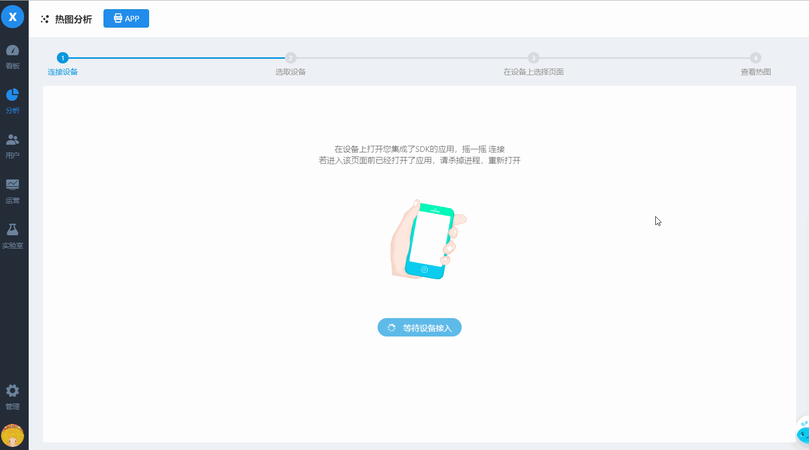

# APP 热图

APP 热图目前支持Android、iOS 原生APP 的点击位置和点击元素热图


区别于 Web 端直接查看页面的热图，APP 端需要先连接 APP，获取页面，再查看当前选择页面的热图


## 使用前准备

需要 SDK 升级到 v4.3.0.1 及以上，设置 `autoHeatMap` 为 `true`，详见 [《Android SDK 集成指南》](../../../integration/sdk/android/#she-zhi-re-tu-cai-ji) 和 [《iOS SDK 集成指南》](../../../integration/sdk/ios/#she-zhi-re-tu-cai-ji)

## 1. 连接 APP 查看热图

进入热图APP页面后，经过以下三步即可查看热图

1. 在手机上打开已经集成了SDK的应用后，摇一摇
2. 选择要连接的设备
3. 选择要查看热图的页面

### 点击位置热图

### 点击元素热图

## 2. 辅助功能

### A 过滤条件

支持通过时间、分群、事件属性和用户属性过滤，满足分析在特定时间段特定人群行为的需求

默认会选中当前连接设备的屏幕宽高和应用版本，即查看的是当前设备大小的用户访问当前版本时的行为，用户可以重新修改条件。

### B 抽样计算

数据量较大时计算会慢，可以选择抽样

### C 强制刷新

当切换了页面时，热图不能即时刷新的情况下，可以选择强制刷新

### D 显示设置

* **D1 调整颜色范围**

        可以调整最大值-最小值的颜色范围，以适应默认颜色区间在背景色上无法突出标识的情况

* **D2 调整背景透明度**

         ****可以调整热图背景透明度，以适应默认透明度下部分背景网页可能无法识别的情况

### E 热门元素列表

查看点击元素热图时可查看热门元素列表

### F 断开连接

当不需要查看热图时，点击断开即可。

### 

