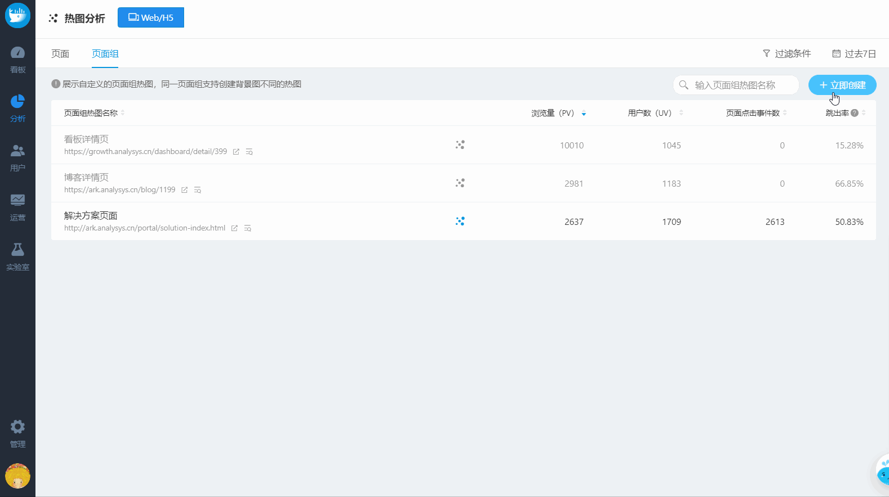

# Web/H5 热图

Web 端支持点击位置热图和浏览深度线，支持在方舟网站中查看，也支持在网站原页面上查看

## 使用前准备

使用**点击位置热图**功能，需要 SDK 升级到 v4.3.0 及以上，设置 `autoHeatmap` 为 `true`，详见 [《JS SDK 集成指南》](vscode-resource:/d:/1%20%E6%98%93%E8%A7%82%E6%96%B9%E8%88%9F/fangzhou-docs/docs/v2/manual/sdk-js.md)

使用**浏览深度线**功能，需要 SDK 设置 `autoWebstay` 为 `true`，详见 [《JS SDK 集成指南》](vscode-resource:/d:/1%20%E6%98%93%E8%A7%82%E6%96%B9%E8%88%9F/fangzhou-docs/docs/v2/manual/sdk-js.md)

## 1. 页面/页面组热图列表

支持合参页面、原始页面、页面组三种页面的热图，三者的区别：

<table>
  <thead>
    <tr>
      <th style="text-align:left">&#x9875;&#x9762;&#x7C7B;&#x578B;</th>
      <th style="text-align:left">&#x8BF4;&#x660E;&#x53CA;&#x4F7F;&#x7528;&#x573A;&#x666F;</th>
    </tr>
  </thead>
  <tbody>
    <tr>
      <td style="text-align:left">&#x539F;&#x59CB;&#x9875;&#x9762;</td>
      <td style="text-align:left">
        
<b>&#x539F;&#x59CB;&#x9875;&#x9762;&#x662F;&#x6307;&#x6CA1;&#x6709;&#x53BB;&#x9664;&#x5C3E;&#x90E8;&#x53C2;&#x6570;&#x7684;&#x9875;&#x9762;&#xFF0C;&#x4FDD;&#x5B58;&#x539F;&#x6765;&#x7684;URL</b>
        

        
&lt;b&gt;&lt;/b&gt;

        
&#x62FF;&#x65B9;&#x821F;&#x9996;&#x9875;&#x4E3E;&#x4F8B;&#xFF0C;&#x6B63;&#x5E38;&#x6765;&#x8BF4;&#x5730;&#x5740;&#x5E94;&#x8BE5;&#x662F;
          <a
          href="https://ark.analysys.cn/">https://ark.analysys.cn</a>&#xFF0C;&#x4F46;&#x5F88;&#x591A;&#x65F6;&#x5019;&#x4E3A;&#x4E86;&#x63A8;&#x5E7F;&#xFF0C;&#x4F1A;&#x628A;&#x94FE;&#x63A5;&#x653E;&#x5230;&#x628A;&#x5B83;&#x653E;&#x5728;&#x4E0D;&#x540C;&#x7684;&#x5730;&#x65B9;&#xFF0C;&#x5C31;&#x9700;&#x8981;&#x52A0;&#x4E0A;&#x4E0D;&#x540C;&#x7684;&#x53C2;&#x6570;&#x6765;&#x6807;&#x8BC6;&#x6765;&#x6E90;&#xFF0C;&#x901A;&#x8FC7;&#x4F1A;&#x5728;&#x94FE;&#x63A5;&#x540E;&#x9762;&#x52A0;&#x95EE;&#x53F7;
            &#xFF1F;&#x52A0;&#x4E0D;&#x540C;&#x7684;&#x53C2;&#x6570;&#xFF0C;&#x4F8B;&#x5982;
            <a
            href="https://ark.analysys.cn/?utm_campaign=on&amp;utm_medium=media&amp;utm_source=analysys&amp;utm_content=fzbutton&amp;utm_term=guide%EF%BC%8C">https://ark.analysys.cn/?utm_campaign=on&amp;utm_medium=media&amp;utm_source=analysys&amp;utm_content=fzbutton&amp;utm_term=guide&#xFF0C;</a>&#x90A3;&#x7528;&#x6237;&#x901A;&#x8FC7;&#x8FD9;&#x4E2A;&#x94FE;&#x63A5;&#x6253;&#x5F00;&#x7684;&#x5373;&#x4E3A;&#x539F;&#x59CB;&#x9875;&#x9762;&#x3002;

      </td>
    </tr>
    <tr>
      <td style="text-align:left">&#x5408;&#x53C2;&#x9875;&#x9762;</td>
      <td style="text-align:left">
        
<b>&#x5408;&#x53C2;&#x9875;&#x9762;&#x662F;&#x6307;&#x53BB;&#x9664;&#x5C3E;&#x90E8;&#x53C2;&#x6570;&#x7684;&#x76F8;&#x540C;URL&#x7684;&#x9875;&#x9762;</b>
        

        
&lt;b&gt;&lt;/b&gt;

        
&#x5408;&#x53C2;&#x9875;&#x9762;&#x89E3;&#x51B3;&#x53C2;&#x6570;&#x4E0D;&#x540C;&#x4F46;&#x5B9E;&#x9645;&#x662F;&#x540C;&#x4E00;&#x4E2A;&#x9875;&#x9762;&#x7684;&#x95EE;&#x9898;&#xFF0C;&#x7CFB;&#x7EDF;&#x81EA;&#x52A8;&#x5408;&#x5E76;&#xFF0C;&#x5408;&#x53C2;&#x524D;&#x540E;&#x9875;&#x9762;&#x672C;&#x8EAB;&#x4E0D;&#x53D8;&#x3002;
           
           &#x5982;&#x4E0A;&#x4E3E;&#x4F8B;&#xFF0C;&#x5728;&#x4E0D;&#x540C;&#x7684;&#x63A8;&#x5E7F;&#x6E20;&#x9053;&#x5E26;&#x4E0D;&#x540C;&#x7684;&#x53C2;&#x6570;&#xFF0C;&#x539F;&#x59CB;&#x9875;&#x9762;&#x4F1A;&#x4E0D;&#x540C;&#xFF0C;&#x4F46;&#x7740;&#x9646;&#x9875;&#x76F8;&#x540C;&#xFF0C;&#x4E3A;&#x4E86;&#x5206;&#x6790;&#x7528;&#x6237;&#x5728;&#x7740;&#x9646;&#x9875;&#x672C;&#x8EAB;&#x7684;&#x884C;&#x4E3A;&#x65F6;&#xFF0C;&#x5C31;&#x9700;&#x8981;&#x5C06;&#x4E0D;&#x540C;&#x53C2;&#x6570;&#x7684;&#x540C;&#x4E00;&#x9875;&#x9762;&#x8FDB;&#x884C;&#x6C47;&#x603B;&#x3002;

      </td>
    </tr>
    <tr>
      <td style="text-align:left">&#x9875;&#x9762;&#x7EC4;</td>
      <td style="text-align:left">
        
<b>&#x9875;&#x9762;&#x7EC4;&#x662F;&#x5177;&#x6709;&#x5171;&#x540C;&#x7ED3;&#x6784;&#x7279;&#x5F81;&#x7684;&#x9875;&#x9762;&#x96C6;&#x5408;</b>
        

        
&lt;b&gt;&lt;/b&gt;

        
&#x89E3;&#x51B3;&#x53C2;&#x6570;&#x4E0D;&#x540C;&#x3001;&#x9875;&#x9762;URL&#x4E0D;&#x540C;&#x3001;&#x4F46;&#x5B9E;&#x9645;&#x662F;&#x540C;&#x4E00;&#x4E2A;&#x9875;&#x9762;&#x7ED3;&#x679C;&#x7684;&#x95EE;&#x9898;&#xFF0C;&#x9700;&#x8981;&#x624B;&#x52A8;&#x5B9A;&#x4E49;&#x3002;
           
           &#x6709;&#x5F88;&#x591A;&#x9875;&#x9762;&#x7ED3;&#x6784;&#x672C;&#x8EAB;&#x662F;&#x76F8;&#x540C;&#x7684;&#xFF0C;&#x6BD4;&#x5982;&#x5546;&#x54C1;&#x8BE6;&#x60C5;&#x9875;&#x3001;&#x65B0;&#x95FB;&#x8D44;&#x8BAF;&#x9875;&#x3001;&#x535A;&#x5BA2;&#x5185;&#x5BB9;&#x9875;&#x7B49;&#xFF0C;&#x53EA;&#x662F;&#x5176;&#x4E2D;&#x7684;&#x5185;&#x5BB9;&#x4F1A;&#x6709;&#x5DEE;&#x5F02;&#xFF0C;&#x5982;&#x679C;&#x9700;&#x8981;&#x5BF9;&#x540C;&#x4E00;&#x4E2A;&#x7ED3;&#x6784;&#x7279;&#x5F81;&#x7684;&#x9875;&#x9762;&#x8FDB;&#x884C;&#x5206;&#x6790;&#xFF0C;&#x5C31;&#x53EF;&#x4EE5;&#x521B;&#x5EFA;&#x9875;&#x9762;&#x7EC4;&#xFF0C;&#x5982;&#x4F55;&#x521B;&#x5EFA;&#x8BE6;&#x89C1;
          <a
          href="../../project-manegement/pagegroup.md#1-chuang-jian-ye-mian-zu">&#x300A;&#x9875;&#x9762;&#x7EC4;&#x7BA1;&#x7406;&#x300B;</a>&#x3002;

      </td>
    </tr>
  </tbody>
</table>### **页面热图列表**

热图通常用于分析着陆页，而着陆页的浏览量一般较大，所以方舟会默认展示出浏览量（PV）TOP 20 的合参页面列表，可以根据跳出率、点击事件数等指标判断是否需要进一步查看相应页面的热图。

#### **展示的指标**

| 指标 | 说明 |
| :--- | :--- |
| 浏览量（PV） | PageView，指用户浏览某个页面或某个页面组的总次数。 |
| 用户数（UV） | Unique Visitor， 访问用户的去重数。 |
| 页面点击事件数 | 用户在页面上点击的总数 |
| 跳出率 | 计算当前页为着陆页时的跳出率，结果为 `-` 时，表示当前页非着陆页。 跳出率=访问了一个页面的Session数/总的 Session 数。用户进入着陆页就离开。用户来到网站后，除了浏览 LandingPage 之外，没有发生其他任何操作就离开了网站，被视为跳出。用来衡量 landingpage 的质量。 |

点击 **页面标题** 或者 **热图图标**，即可进入具体的热图页面进行分析，详见 [2. 点击位置热图](https://docs.analysys.cn/ark/features/analytics/heatmap#2-dian-ji-wei-zhi-re-tu)


当页面事件数为 0 时，即表示缺少绘制热图需要的数据，可能是以下原因之一，需要逐一排查

1. 还没有用户访问当前页面
2. 当前所选时间范围、过滤条件下没有用户访问行为，可以重新调整筛选条件
3. SDK 未开启热图功能，即设置 `autoHeap` 为 `true`


**辅助功能**

#### **A 过滤条件**

支持通过时间、分群、事件属性和用户属性过滤，满足分析在特定时间段特定人群行为的需求

#### **B 搜索**

支持从全部页面中搜索，不仅仅是浏览量 TOP 20 的页面

#### **C 星标置顶**

对于最常关注的页面，可以移入所在行，点击列头的星标置顶在列表上方，此时列表总共会展示 星标页面 + 额外浏览量 TOP 20 的页面

#### **D 排序**

默认星标的页面置顶在上方，剩余页面按照浏览量（PV）从大到小排序；

支持按照各个字段和是否星标重新排序。

#### **E 打开原页面**

移入链接后面打开网页的 icon，点击即可新标签页打开原始网页

#### **F 下钻查看原始页面**

移入链接后面查看原始页面的icon，点击即可查询该合参页面的原始页面数据

默认展示浏览量 TOP 20 的原始页面

### **页面组热图列表**

页面组是具有共同结构特征的页面集合，如商品详情页、新闻资讯页。方舟支持在设定的背景页面上绘制具有页面组的点击行为热度。

#### 创建页面组热图

点击 **+ 立即创建** ，打开右侧抽屉，三步创建

1. 选择要进行热图分析的页面组：在[页面组管理](../../project-manegement/pagegroup.md)中创建的页面组中选择，也支持新创建
2. 设置背景图：作为渲染热图的底图
3. 命名热图：页面组热图名称不能重复


注意事项：

1 页面组中的页面结构相同时分析热图才有意义

2 设置的背景图需要和页面组中的页面属于同一结构，才能将页面组中的点击行为汇总渲染在背景图上，否则无法展示热图


页面组热图列表中仅展示自己创建的页面组热图。

#### 展示的指标

同页面热图列表，详见上方 [页面热图列表-展示的指标](https://docs.analysys.cn/ark/features/analytics/heatmap/web#ye-mian-re-tu-lie-biao)

**辅助功能**

#### **A 过滤条件**

支持通过时间、分群、事件属性和用户属性过滤，满足分析在特定时间段特定人群行为的需求

#### **B 搜索**

支持根据页面组热图名称搜索

#### **C 排序**

默认按照浏览量（PV）从大到小排序，支持按照各个字段重新排序。

#### **D 打开背景原页面**

移入链接后面打开网页的 icon，点击即可新标签页打开创建页面组热图时选择的背景页

#### **E 下钻查看原始页面**

移入链接后面查看原始页面的icon，点击即可查询该页面组的原始的页面

默认展示浏览量 TOP 20 的原始页面

## 2. 点击位置热图

点击位置热图展示用户在网站上所有点击的位置，聚集的点击越多，颜色越亮。

通常用于分析着陆页，判断用户是否点击了CTA的内容？ 否有被大量点击的重要按钮或元素被放到了很少有用户到达的地方？ 是否有用户点击的图片或文字其实没有链接等等。

**支持两种查看热图的方式：**

* 嵌入式：在方舟当中直接查看热图
* 交互式：打开原页面查看，关闭热图时，可以与原页面交互


无论是哪种热图查看方式，展示的都是在指定过滤条件和时间范围下的用户的行为，默认所有用户，过去7日的数据；

当在热图列表时就选择了条件，条件在热图页的时候仍然生效；同时支持再次修改条件。


### 嵌入式热图

对于支持 iframe 嵌入和 https 协议的页面可以在方舟产品中直接查看热图 

**辅助功能**

#### A 选择终端设备类型

通常同一网站在不同终端（e.g. PC、手机）上会做适配，即用户在不同终端上看到的页面布局甚至是部分的内容会不同，用户的行为也会不同。

用户可以选择左上角切换不同的终端，会呈现出不同终端情况下看到网页，渲染出相应的热图，目前支持查看三种终端下的用户行为热图：

* PC
* 平板
* 手机

比如切换到手机，即可查看在在手机终端上用户查看网页时的热图。

#### B 显示设置

* **B1 显示浏览深度线**

        打开后可以在热图中同时查看浏览深度线

* **B2 调整颜色范围**

        可以调整最大值-最小值的颜色范围，以适应默认颜色区间在背景色上无法突出标识的情况

* **B3 调整背景透明度**

         ****可以调整热图背景透明度，以适应默认透明度下部分背景网页可能无法识别的情况

#### **C 热图开关**

关闭热图后可以与原页面进行交互，当存在弹窗时，可点击后再打开热图刷新，查看弹窗中的点击热图

#### **D 强制刷新**

当选择同样条件查看热图时，会存在缓存；或者是与原页面产生交互需要重新计算热图数据时，可以点击刷新，强制重新计算

#### **E 帮助文档**

使用过程中有疑问时，可以查看帮助文档

#### **F 原页面打开**

点击原页面打开，可以新标签页跳转到原网站地址查看热图

### 交互式热图

对于符合以下特征的页面无法在方舟查看热图

* 网站禁止了 iframe 的加载
* 网站没有使用 https 协议

此时可以打开原页面查看交互式热图

**辅助功能**

#### **A-D 显示设置、热图开关、强制刷新、帮助文档同的嵌入式热图**

#### **E 展开/收起**

通常页面头部是导航位置，但默认会被热图工具条遮挡，点击可以收起；当需要进行热图设置时，可以点击再次展开。

## 3. 浏览深度线

浏览深度线代表用户抵达此区域后的留存比例。百分比越低，越少用户能够看到这一位置。

通用用于：

1. 寻找CTA的最佳位置
2. 内容营销转换监测e.g.数据骤降时，说明哪里出现了内容上的断裂，用户没有兴趣再看下去

目前可以在的点击热图热图中，打开显示浏览深度线

## 常见问题

### 热图计算的是全量数据吗？

当热图数据过大时，会导致浏览器崩溃或卡死，为了避免这种情况，同时保证数据能更真实的反映实际情况，当点击量超过7000时，我们会均匀抽样7000个点来渲染热图。

### 改变浏览器窗口大小时绘制的热图问题

当浏览器窗口大小改变后，绘制的结果就不再准确，此时点击强制刷新来调整热图。

### 

