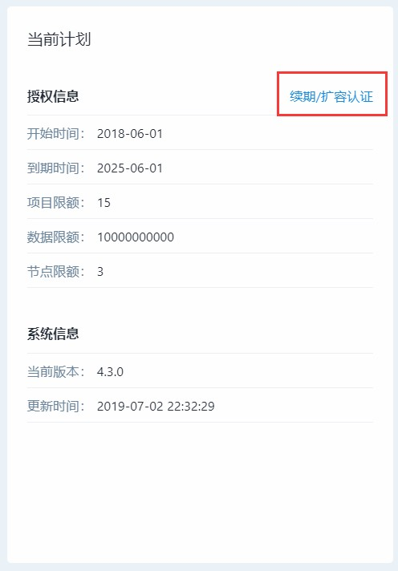

# 企业概览

主要展示平台的一些基本信息，平台项目、平台成员、当前计划以及成员访问记录

## A. 平台项目

显示平台可以创建的项目数量上限，以及已经创建的项目数据和项目名称，也可以点击更多进入项目列表，查看项目的详细信息

点击添加可以直接添加项目名称

## B. 平台成员

显示平台可以添加成员的数量上限，以及已经添加的成员数量和成员姓名，也可以点击更多进入成员列表，查看成员的详细信息

点击添加可以直接添加成员

## C. 当前计划

展示当前部署的方舟的版本情况。


**Licence 到期后数据接收会停吗？**

Licence 到期前 30 天产品里就会出现更新 Licence 的提示，但若超期产品就会无法使用。不过考虑到某些情况下 Licence 更新会滞后，为避免数据不连续，数据接收服务依然会保持一段时间的工作。这样，稍后更新 Licence 之后，就可以看到连续的数据了。


## D. 访问记录

显示登录用户姓名、以及访问平台的时间和IP。

> 注：访问记录只展示最新100条的记录

