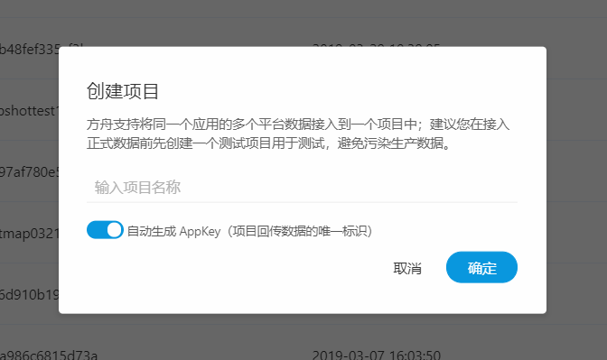

# 项目管理

易观方舟支持在企业平台中，创建多个项目，在企业平台-项目管理中可以进行统一管理， 包括查看项目列表、创建项目、修改项目名称和LOGO、添加项目管理员等。

## A. 创建项目

点击 **创建项目**，输入项目名称，支持自动生成 AppKey（项目回传数据的唯一标识），若有运维查询数据等特殊需要可以手动输入 AppKey。


易观方舟支持将同一个应用的多个平台数据接入到一个项目中；建议您在接入正式数据前先创建一个测试环境项目用于测试，避免污染生成数据。

建议自动生成 AppKey，若手动输入时，仅支持小写字母和数字的组合，且在10~16位之间。


## B. 项目修改/删除

支持修改项目基础资料、删除项目 

* 修改项目LOGO：默认项目名称首字母作为项目 LOGO，移入后可以上传 LOGO，多个项目时便于快速识别
* 修改项目名称：点击设置 icon，可以修改项目名称
* 删除项目：点击删除icon，支持输入当前用户的密码后删除项目。


项目删除后数据将停止接收、不可再进入项目使用、包括历史数据也将被删除；且删除操作不可逆，无法恢复，所以请谨慎操作。


## C. 设置项目管理员

项目管理员具有一个项目的最高权限，支持全部功能和在项目中添加成员，授权给不同的用户不同的项目权限。

## D. 查看回数状态

* 已回数的项目可以点击进入项目进行分析；
* 未回数的项目可以点击链接前往集成页面。

## E. 查看分区数/设置数据流状态

* 分区数：1-3个，实时数据的并发算子。用于运维调配计算资源，若 DAU 比较高，同一时间上报的数据量较大，则分区数需加大。
* 数据流状态：开启/关闭。项目创建后默认开启数据，数据开始正常接收和处理；当数据流因为升级暂时关闭或者其他意外情况没有停止时，支持再次手动开启。

