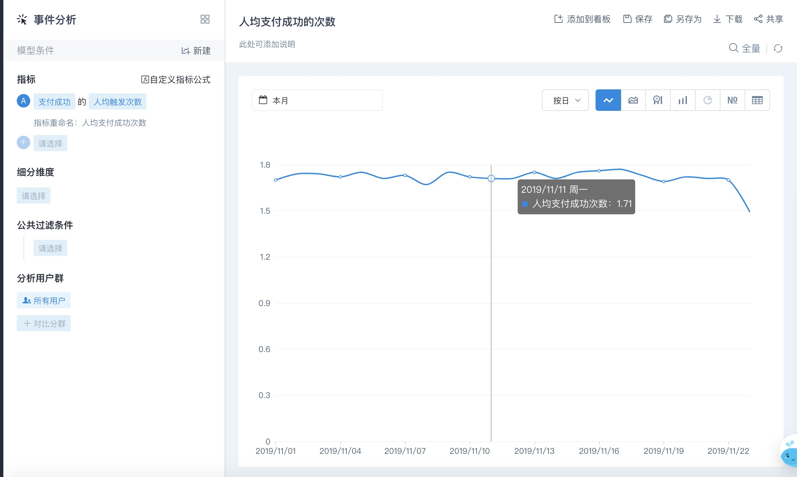
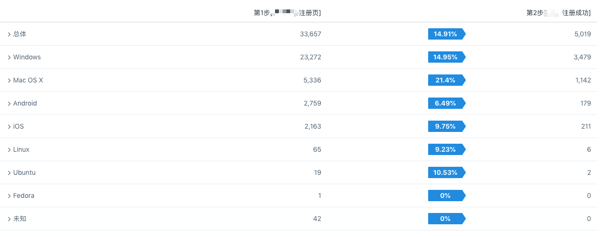

# 指标说明

指标是度量，是量化衡量的标准。

不同类型的业务、不同的产品阶段、不同的角色（老板、产品、运营等）所关注的指标会有差异，大部分指标都源自于用户的行为，因此易观方舟支持通过十余个分析模型选择埋点事件和属性高度灵活地构建指标，多种维度细分实时查询，大大提升数据监控和分析灵活性和效率；当然也预置了一些访问级的常用指标。 

其中提供的分析模型也都围绕着用户生命周期，与通常用AARRR框架搭建指标体系的思路一致，以下列举一些常用的分析模型和可构建的指标，详细说明阅读：



## 常用分析模型和指标构建

<table>
  <thead>
    <tr>
      <th style="text-align:left">&#x5E38;&#x7528;&#x6A21;&#x578B;</th>
      <th style="text-align:left">&#x53EF;&#x6784;&#x5EFA;&#x7684;&#x6307;&#x6807;</th>
    </tr>
  </thead>
  <tbody>
    <tr>
      <td style="text-align:left">&#x4E8B;&#x4EF6;&#x5206;&#x6790;</td>
      <td style="text-align:left">
        
&#x6240;&#x6709;&#x57FA;&#x4E8E;&#x4E8B;&#x4EF6;&#x7684;&#x539F;&#x5B50;&#x6307;&#x6807;&#x90FD;&#x53EF;&#x4EE5;&#x901A;&#x8FC7;&#x4E8B;&#x4EF6;&#x5206;&#x6790;&#x6765;&#x6784;&#x5EFA;&#xFF0C;&#x6BD4;&#x5982;&#x5E38;&#x89C1;&#x7684;&#x6D3B;&#x8DC3;&#x7528;&#x6237;&#x6570;&#x3001;&#x542F;&#x52A8;&#x6B21;&#x6570;&#x3001;&#x652F;&#x6CE8;&#x518C;&#x7528;&#x6237;&#x6570;&#x3001;&#x4EBA;&#x5747;&#x652F;&#x4ED8;&#x91D1;&#x989D;&#x7B49;&#x6307;&#x6807;&#xFF1B;

        
&#x4E5F;&#x652F;&#x6301;&#x539F;&#x5B50;&#x6307;&#x6807;&#x4E4B;&#x95F4;&#x8FDB;&#x884C;&#x56DB;&#x5219;&#x8FD0;&#x7B97;&#x6784;&#x5EFA;&#x884D;&#x751F;&#x6307;&#x6807;

      </td>
    </tr>
    <tr>
      <td style="text-align:left">Session&#x5206;&#x6790;</td>
      <td style="text-align:left">&#x4F1A;&#x8BDD;&#x7EA7;&#x522B;&#x7684;&#x6307;&#x6807;&#xFF0C;&#x6BD4;&#x5982;&#x8BBF;&#x95EE;&#x6B21;&#x6570;&#x3001;&#x8BBF;&#x95EE;&#x65F6;&#x957F;&#x3001;&#x8DF3;&#x51FA;&#x7387;&#x7B49;&#x6307;&#x6807;</td>
    </tr>
    <tr>
      <td style="text-align:left">&#x6E20;&#x9053;&#x5206;&#x6790;</td>
      <td style="text-align:left">&#x4F1A;&#x8BDD;&#x7EA7;&#x522B;&#x7684;&#x6307;&#x6807;&#xFF0C;&#x7EC6;&#x5206;&#x6E20;&#x9053;&#x7EF4;&#x5EA6;&#xFF0C;&#x6BD4;&#x5982;&#x4E0D;&#x540C;&#x6D41;&#x91CF;&#x6765;&#x6E90;&#x7684;&#x8BBF;&#x95EE;&#x7528;&#x6237;&#x6570;&#x3001;&#x4E0D;&#x540C;&#x7740;&#x9646;&#x9875;&#x7684;&#x9875;&#x9762;&#x6D4F;&#x89C8;&#x91CF;&#x7B49;</td>
    </tr>
    <tr>
      <td style="text-align:left">&#x7559;&#x5B58;&#x5206;&#x6790;</td>
      <td style="text-align:left">N&#x65E5;/&#x5468;/&#x6708;&#x7559;&#x5B58;&#x7528;&#x6237;&#x3001;&#x7559;&#x5B58;&#x7387;&#x3001;&#x6D41;&#x5931;&#x7528;&#x6237;&#x3001;&#x6D41;&#x5931;&#x7387;&#x7B49;</td>
    </tr>
    <tr>
      <td style="text-align:left">&#x8F6C;&#x5316;&#x6F0F;&#x6597;</td>
      <td style="text-align:left">&#x5173;&#x952E;&#x8DEF;&#x5F84;&#x7684;&#x8F6C;&#x5316;&#x7528;&#x6237;&#x6570;&#x3001;&#x8F6C;&#x5316;&#x7387;&#x3001;&#x8F6C;&#x5316;&#x65F6;&#x957F;&#x7B49;</td>
    </tr>
    <tr>
      <td style="text-align:left">&#x5C5E;&#x6027;&#x5206;&#x6790;</td>
      <td style="text-align:left">&#x7528;&#x6237;&#x6784;&#x6210;&#xFF0C;&#x6BD4;&#x5982;&#x5730;&#x7406;&#x4F4D;&#x7F6E;&#x5206;&#x5E03;&#x3001;&#x4F1A;&#x5458;&#x7C7B;&#x578B;&#x5206;&#x5E03;&#x7B49;</td>
    </tr>
    <tr>
      <td style="text-align:left">&#x5206;&#x5E03;&#x5206;&#x6790;</td>
      <td style="text-align:left">&#x7EF4;&#x5EA6;&#x503C;&#x7684;&#x533A;&#x95F4;&#x5206;&#x5E03;&#xFF0C;&#x6BD4;&#x5982;&#x4F7F;&#x7528;&#x6B21;&#x6570;&#x5206;&#x5E03;&#x3001;&#x4F7F;&#x7528;&#x65F6;&#x6BB5;&#x5206;&#x5E03;&#x3001;&#x652F;&#x4ED8;&#x8BA2;&#x5355;&#x91D1;&#x989D;&#x5206;&#x5E03;</td>
    </tr>
  </tbody>
</table>## 1 基于事件分析构建指标

### Web 页面浏览量（PV）

指 Web 页面浏览的总次数，同一页面刷新多次也会被重复计入。

### Web 访问用户数（UV）

UV（Unique Visitor），通常用以表示Web端网站的去重访问用户。对于网站而言，根据cookie生成的ID为判断标准，如果访客更换浏览器或清除cookie，会计为新的UV。

### APP 活跃用户数

传统意义上活跃用户是指一段时间里启动APP的设备数，时间粒度往往是日、月，按日统计时就是 DAU，按月统计就是 MAU


在方舟中用户是指与网站、APP、小程序等产生交互的主体，使用方可以自己在上报数据的时候决定使用设备ID标识，还是注册用户标识。

可以自定义什么是活跃用户，可以是启动的用户数，也可以是发生任意行为的用户，也可以是登录的用户……根据实际业务口径去构建即可

若同时有Web、APP、小程序的数据接入，也可以添加条件过滤或者是细分平台维度


**示例：**

> 定义：移动端启动的用户数，同一用户在一天内访问多次仅被计为一个用户
>
> 指标：启动的触发用户数
>
> 条件：平台 = Android、iOS
>
> 分群：所有用户
>
> 时间粒度：按日

### APP 启动次数

指启动 APP 的总次数。启动多次会被累加。

### 新增用户数

通常意义上新增用户是以首次启动 APP 或首次访问网站来定义，APP 卸载后再安装，后者网站被清除cookie ，都会被计为新增用户。


方舟当中预置了 **新访问用户** 动态分群，方便在各个分析模块中快速选择查看新用户表现。


在 _新访问用户_ 的分群下，选择 _启动的触发用户数_ 即为常规意义上的新增用户数，若Web、APP等多平台数据上报在一个项目中，则可以条件过滤，或者细分平台维度

在图表区域选择不同的时间粒度，即按日、周、月去查询各个粒度下的新增用户数，也可以选择数值图，查看选定区间里的新增用户


预置的新访问用户是根据首次访问时间是哪一天来判断用户是哪一天新增的，所以选择在所有用户下，选择启动的触发用户数，添加首次访问时间 是在启动当天  也可以得到相同的结果

⚠️首次访问时间是 SDK 判断用户是首次访问时调用 profile\_set\_once 上报，所以在接入阶段一定要验证是否正确集成



1. 不建议在新访问用户分群下的基础上，选择任意事件的触发用户数保存为新增用户，因为任意事件可能包含了一些被动事件，比如消息推送成功、服务端返回的成功事件等。
2. 在所有用户基础上，选择启动的触发用户数，添加条件是否安装后首日访问 = 是，也可以作为新增用户的定义，但与系统预置的新访问用户的口径不一致，因为数据上报的差异可能会出现偏差，不具有可比性，所以尽量在同一产品中使用相同口径。


### 新增注册用户数

对于有帐号体系的产品来说，相较于访问用户数，用注册用户数衡量有效用户会更精准。在选定时间段内注册成功的用户会被计入新增注册用户。


方舟当中预置了 新增注册用户 动态分群，但当且仅当在用户属性中上报了注册时间，且属性ID 使用预置的 $signup\_time

另外，为了更准确的获取注册成功的时间，建议在服务端而非客户端埋点。


**除了上述基础指标之外， 事件分析可以基于事件、事件属性构建出任意指标，在指定分群下、指定时间范围、时间粒度下分析**


**事件和属性都来自于SDK埋点上报或数据导入。**


### 事件 X 的触发用户数

指点击了事件 X 的用户数。同一用户在同一个时间粒度里发生多次行为时仅被计为一个用户。

如下图，表示本月每天支付成功的用户数，当同一个用户在同一天里多次购买成功支付时，在这一天里这个用户只会被记1。

### 事件 X 的触发次数

指点击了事件 X 的总次数。同一用户在同一个时间粒度里发生多次行为时会累加。

如下图，表示本月每天支付成功的次数，当同一个用户在同一天多次购买支付成功时，次数会被累加。

### 事件 X 的人均触发次数

指人均点击事件 X 的次数 = X 的触发次数 / X的触发用户数

如下图，表示本月每天人均支付成功的次数。

### 事件 X 的属性 Y 的去重数

指在触发事件 X 时 属性 Y 出现的独立去重个数。

如下图，表示本月里每天用户支付成功的商品类别数量。比如11月11日里，3个用户成功购买，分别购买了如下，则支付成功的商品分类数量为5

| 商品一级分类 | 小明 | 小李 | 小王 |
| :--- | :--- | :--- | :--- |
| 电子设备 | 1 | 1 | 1 |
| 服装 | 2 | 3 | 1 |
| 家具 | 1 | 0 | 2 |
| 植物 | 2 | 0 | 0 |
| 食品 | 4 | 1 | 4 |
| 虚拟商品 | 0 | 0 | 0 |

### 事件 X 的属性 Y 的总和

指选定事件的属性的属性值总和。

如下图，表示本月里每天用户支付成功的订单金额总和。

### 事件 X 的属性 Y 的均值

指选定事件的属性的属性值的算数平均数 = 属性值总和 / 属性值个数。

如下图，表示本月里每天用户支付成功的订单的平均金额，即订单金额总和/订单数。

### 事件 X 的属性 Y 的最大值

指选定事件的属性的属性值中的最大值。

如下图，表示本月里每天用户支付成功的最大订单金额。

### 事件 X 的属性 Y 的最小值

指选定事件的属性的属性值中的最小值。

如下图，表示本月里每天用户支付成功的最小订单金额。

### 事件 X 的属性 Y 的人均值

指选定事件的属性的属性值总和 / 事件的触发用户数。

如下图，表示本月里每天平均每个用户支付的订单金额。

### **自定义指标公式**


除了事件相关指标外，方舟支持自定义指标公式，构建无法通过选择事件得出的指标，比如 ARPU、ROI 等。

支持加、减、乘、除、括号及常数的四则运算


比如通过支付订单金额总和 - 退货金额总和 即可创建出实际完成订单金额的指标，如下图表示过去7天实际完成订单金额的趋势，可以增加额外指标对比分析。

更多使用详见



## 2 基于 Session 分析的指标

事件是指何人何时在何地用何种方式做何事的单点用户行为。会话（Session）则指一系列的事件，用以描述用户在一次访问中做了一些什么事儿。进而分析用户来访的频次、时长、深度等，从不同角度指导精细化运营。


怎样一系列的行为？方舟默认session切割的规则详见：[https://docs.analysys.cn/ark/features/analytics/channel/session](https://docs.analysys.cn/ark/features/analytics/channel/session)


以下指标都基于默认的 Session 规则来计算：

### 访问次数

指用户访问应用的总次数，即会话（session）数。

### 人均访问次数

人均访问次数 = 访问次数（Session数）/ 访问用户数（UV）。

### 总访问时长

Session 时长之和

### 单次访问时长

单次访问时长 = Session时长之和 / 访问次数（Session数）。

### 单次访问深度

单次访问深度 = Session事件之和 / 访问次数（Session数）。

### 跳出次数

指访问一个页面后离开的Session数（仅适用于 web/H5/小程序）

### 跳出率

跳出率 = 访问了一个页面的Session数 / 总的Session数 \* 100%

当用户来到网站后，除了浏览着陆页之外，没有发生其他任何操作就离开了网站，被视为跳出。用来衡量着陆页的质量。

### 退出次数

该页面是会话中“最后一页”的Session数（仅适用于 web/H5/小程序）。

### 退出率

某页面退出率 = 从某页面离开网站的次数/该页面浏览总次数\*100%

当用户从某个页面离开了网站，即视为退出。退出率只能用来分析特定流程中的某些页面能不能满足用户的需求的问题。

### 人均访问时长

人均访问时长 = Session时长之和 / 访问用户数（UV）

### 总页面停留时长

所有页面停留时间累加，去除非浏览页面时间

### 平均页面停留时长

平均页面停留时长 = 总页面停留时长 /（PV - 退出次数）

更多使用方法详见



## 3 基于渠道分析的指标


渠道分析模型中分析的是用户的每一次访问的来源（即一个Session的来源）。当用户产生一次访问时，会根据上报的URL中的UTM参数、referrer信息来识别不同的渠道属性，具体处理规则详见文末 [《附：渠道来源识别规则》](analytics/channel/processing-logic.md)


从下拉框中可以选择不同平台下的渠道分析维度，具体维度如下：

| 属性名称 | 属性说明 | 平台 | 预置属性ID | SDK采集/数据处理说明 |
| :--- | :--- | :--- | :--- | :--- |
| 来源地址 | 页面来源 | Web/H5、小程序 | $referrer | SDK上报 |
| 来源域名 | 页面来源域名，e.g.baidu.com | Web/H5 | $referrer\_domain | SDK上报 |
| 渠道来源分组 | 渠道来源分组，e.g.搜索引擎、社交媒体、直接访问等 | Web/H5 | $traffic\_source\_type | 根据规则处理，方舟提供预置分组 |
| 活动/广告名称 | 活动/广告名称 | Web/H5、小程序、APP | $utm\_campaign | SDK上报，部分数据处理 |
| 活动/广告媒介 | 活动/广告媒介 | Web/H5、小程序、APP | $utm\_medium | SDK上报，部分数据处理 |
| 活动/广告来源 | 活动/广告来源 | Web/H5、小程序、APP | $utm\_source | SDK上报，部分数据处理 |
| 活动/广告内容 | 活动/广告内容 | Web/H5、小程序、APP | $utm\_content | SDK上报，部分数据处理 |
| 活动/广告关键字 | 活动/广告关键字 | Web/H5、小程序、APP | $utm\_term | SDK上报，部分数据处理 |
| 搜索引擎 | 标识搜索引擎来源，e.g.百度 | Web/H5 | $search\_engine | 根据referrer解析 |
| 搜索词 | 标识搜索词，e.g.易观方舟 | Web/H5 | $search\_keyword | 根据referrer解析 |
| 社交媒体 | 标识社交媒体来源，e.g.微博 | Web/H5 | $social\_media | 根据referrer解析 |
| 社交媒体分享来源 | 标识社交媒体分享来源，e.g.微信朋友圈、微信群 | Web/H5 | $social\_share\_from | 根据referrer和url解析 |
| APP下载渠道 | 下载渠道 | APP | $channel | SDK上报 |
| 场景值 | 标识小程序的场景值，e.g顶部搜索框的搜索结果页 | 小程序 | $scene | SDK上报，根据referrer中的参数解析 |
| 场景值类型 | 标识小程序的场景分类 | 小程序 | $scene\_type | 根据规则方舟，方舟提供预置分组 |

### 渠道的基础指标

| 基础指标 | 指标说明 | 平台 |
| :--- | :--- | :--- |
| 访问用户数（UV） | Unique Visitor， 访问用户的去重数 | Web/H5、小程序 |
| 访问次数 | 指用户访问应用的总次数，即会话（Session）数 | Web/H5、小程序 |
| 浏览量（PV） | 指用户浏览Web/H5页面的总次数，同一个页面访问多次会被重复计 | Web/H5、小程序 |
| 人均访问次数 | 人均访问次数=访问次数/访问用户数（UV） | Web/H5、小程序 |
| 人均页面浏览量 | 人均页面浏览量=浏览量（PV）/访问用户数（UV） | Web/H5、小程序 |
| 人均访问时长 | 人均访问时长=Session时长之和/访问用户数（UV） | Web/H5、小程序 |
| 单次访问页面浏览量 | 平均每次访问浏览页面的次数，单次访问页面浏览量=浏览量（PV）/访问次数 | Web/H5、小程序 |
| 单次访问时长 | 平均每次访问的时长，单次访问时长=总访问时长/会话数 | Web/H5、小程序 |
| 单次访问事件数 | 平均每次访问的事件数量（包括浏览页面和点击事件），单次访问事件数=总访问事件数/会话数 | Web/H5、小程序 |
| 跳出率 | 跳出率=访问了一个页面的Session数/总的Session数。用户进入着陆页就离开用户来到网站后，除了浏览LandingPage之外，没有发生其他任何操作就离开了网站，被视为跳出。用来衡量Landingpage的质量。 | Web/H5、小程序 |
| 次日留存率 | 某日访问的用户在第2日再次来访问的用户数 | Web/H5、小程序、APP |
| 7日留存率 | 某日访问的用户在第7日再次来访问的用户数 | Web/H5、小程序、APP |
| 14日留存率 | 某日访问的用户在第14日再次来访问的用户数 | Web/H5、小程序、APP |
| 30日留存率 | 某日访问的用户在第30日再次来访问的用户数 | Web/H5、小程序、APP |
| 活跃用户数 | Unique Visitor， 访问用户的去重数 | Web/H5、小程序、APP |
| 访问次数 | 指用户访问应用的总次数，即会话（Session）数 | Web/H5、小程序、APP |
| 人均访问时长 | 人均访问时长=Session时长之和/访问用户数（UV） | Web/H5、小程序、APP |

### 渠道的转化目标

每一次活动的转化目标可能会不同，方舟支持自定义选择一个事件作为转化目标，来更有效的衡量不同渠道最终的转化质量。

| 转化指标 | 指标说明 | e.g. 转化目标：点击购买 ；访问来源：谷歌搜索 |
| :--- | :--- | :--- |
| x事件的转化用户数 | 指某个渠道进来的用户触发了x事件的用户数 | 从谷歌搜索进入网站之后点击购买的用户数 |
| x事件的转化用户数占比 | x事件的转化用户数/总访问用户数 | 从谷歌搜索进入网站之后点击购买的用户数/进入网站访问的总用户数 |
| x事件的转化次数 | 指某个渠道进来的用户触发了x事件的会话次数 | 从谷歌搜索进入网站之后发生了点击购买的访问次数 |
| x事件的转化次数占比 | x事件的转化次数/总访问次数 | 从谷歌搜索进入网站之后发生了点击购买的访问次数/进入网站的总次数 |
| x事件的y属性z指标 | x事件的y属性z指标（不同数据类型的属性值有不同的指标） | 从谷歌搜索进入网站之后点击购买的购买金额的总和 |

更多使用说明详见



## 4 基于留存分析构建指标

留存，是指用户在 APP、网站等应用上使用过，并一段时间后仍有使用。

留存分析模型是一种衡量用户健康度/参与度的方法，超越下载量、DAU 等这样的虚荣指标，深入了解用户的留存和流失状况，发现影响产品可持续增长的关键因素，指导市场决策、产品改进、提升用户价值等等。

### 留存**用户**数

指发生初始行为的用户经过一段时间后，发生了回访行为的用户。

例如选择条件：初始行为=点击购买，回访行为=点击购买，4月1日发生购买的用户200人，这200人中4月2日再次购买的用户有100人，4月4日再次购买的用户有50人，则第1日自定义留存用户为100，第3日留存用户为50。

### **留存率**

 指第N日/周/月后回访的留存用户数对于初始行为用户数的占比。

### 流失用户数

指发生初始行为的用户经过一段时间后，没有再次回访行为的用户。

### **流失率**

指第N日/周/月后没有回访的用户数对于初始行为用户数的占比。


根据选择不同的条件构建新用户、活跃用户或者特定行为的留存、流失


### **新用户留存**

**移动端：** 在新访问用户下选择条件【初始行为 = 启动，回访行为 = 启动】，即可分析新用户在首次使用应用后的留存情况

**H5/Web/小程序：** 在新访问用户下选择条件【初始行为 = 浏览页面，回访行为 = 浏览页面】，即可分析新用户在访问网站后的留存情况

### **活跃用户留存**

**移动端：** 在所有用户下选择条件【初始行为 = 启动，回访行为 = 启动】，即可分析活跃的用户后续使用应用的情况

**H5/Web/小程序：** 在所有用户下选择条件【初始行为 = 浏览页面，回访行为 = 浏览页面】，即可分析用户活跃的用户在后续访问网站的情况

### **自定义留存**

相较分析新增/活跃用户的总体留存情况，关注业务的核心事件使用情况，会更有利于发现用户的行为模式和其中可能存在的问题。

e.g. 对于电商的运营，可以定义【 初始行为 = 支付订单，回访行为 = 支付订单】 了解用户的复购行为，多长时间会产生复购，可以进一步分析这些忠实用户的行为特征；对于问答应用，可以定义【初始行为 = 注册 ，回访行为 = 评论 】，了解用户在注册后有多少用户在多长的频率里会参与进来。

**不同的分析场景中可以设置多个不同的留存条件来分析：**

**初始行为和回访行为设置为相同**，对比不同的功能，重复发生的情况，发现用户对不同功能的使用粘性；

**初始行为相同，设置不同的回访行为**，对比同一个优化，是否对其他功能有不同的影响；

**回访行为相同，设置不同的初始行为**，对比发现不同的运营手段、产品功能对核心业务目标的影响。

更多使用说明详见



## 5 基于转化漏斗的指标

### 总体转化率

总体转化率 = 最后一步转化的用户数 / 第一步用户数 \* 100%

### 各步骤转化用户数

指在一定的窗口期内有序触发了自定义行为事件的用户，即完成从上一步骤到下一步骤转化的去重用户数

### 各步骤转化率

第 n 步转化率  =第 n+1 步骤转化用户数 / 第 n 步转化用户数 \* 100%

### 各步骤流失用户数

指在一定的窗口期内触发了上一步事件但下一步事件未有序触发的用户，即上一个步骤的用户数 - 上个步骤到该步骤转化的用户数

### 各步骤流失率

第 n 步流失率=（第 n 步转化用户数 - 第 n+1 步骤转化用户数）/ 第 n 步转化用户数

### **转化时间中位数**

指完成从上一步骤到下一步骤转化，用户所需时间的中位数


**实际应用场景**

通过细分维度提高核心漏斗转化率，洞察转化率优化空间。

解决流程：

1. 构建转化漏斗：通过漏斗分析，清晰展示漏斗的转化率
2. 通过细分维度进行漏斗下钻，发现移动端的转化率明显低于平均水平
3. 解决办法：首先通过行为序列判断是否因为兼容而产生问题，其次去为移动端单独准备着陆页


更多使用说明详见



## 6 基于属性分析的指标

通过属性分析，可以快速查看在不同属性上的用户数分布情况

更多使用说明详见



## 7 基于分布分析构建指标

### 事件 X 的频次分布

统计某一个事件发生次数的分布情况，默认区间为 \[0,3\)、 \[3,5\) 、\[5,10\)、\[10,20\)、\[20,50\)、\[50,100\)、\[100,+∞\)

如下图，表示过去7日，启动小于3次、3～5次、5～10次、10～20次、20～50次、50～100次、100次以上的用户数

### 事件 X 的发生时段分布

统计某一个事件发生时间的分布情况，默认区间以每小时为间隔，共分为 24段

如下图，表示过去7日，各个时段启动的用户分布

### 事件 X 的属性 Y 的 Z 的分布

指选定事件的属性的属性值的总和/均值/最大值/最小值/人均值的分布

如下图，表示过去7日支付金额总额的用户分群情况

更多使用说明详见




以上内容没有解答我的问题？[点击我来反馈](https://support.qq.com/products/118522/) 🚀


