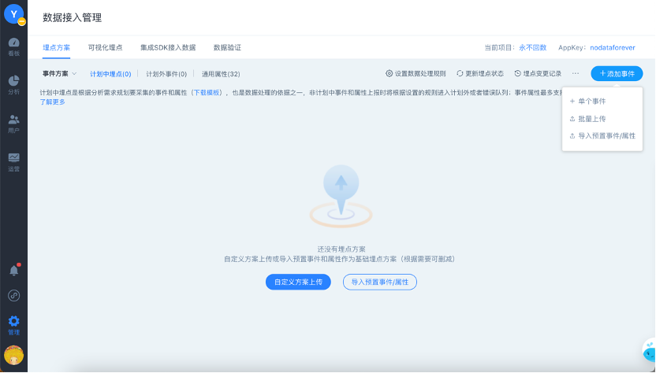
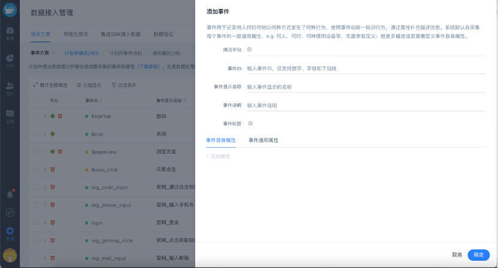

# 埋点方案

在实际应用中，很多数据不准确、无法计算的问题最后多数定位到是埋点缺失、错误等造成的，因此严格控制数据质量是非常必要和重要的事情。

埋点方案功能正是通过以下三点来保障数据质量：

1. 数据采集需求管理，方案可共享保证需求来源一致，来源可记录，变更可追踪 —— 通过埋点的增删改、记录变更历史功能实现
2. 将埋点方案作为数据处理规则，规避无效数据污染数据源 —— 通过设定计划外（埋点方案外）的数据处理规则实现
3. 通过埋点方案自动化校验，提高验证效率 —— 通过检测埋点状态功能来实现

## 设计埋点方案

### 设计前准备

**确定数据分析和应用的核心诉求**

* 验证功能设计是否合理？帮助产品迭代？
* 关键流程的转化情况？
* banner广告/推荐位的效果转化？
* 注册/登录的用户情况？
* 自动化运营

**确定核心业务的关键路径**

拆解各环节，设定环节指标（如各环节转化率），根据环节指标，提取动作行为，即事件，该事件就是我们要进行统计的埋点位。

**确定用户属性**

确定描述用户的维度，比如性别、用户等级等后续用于分析的属性。

### 设计埋点方案

经过前期准备，按照方舟当中的数据模型，可以把埋点方案拆分为两部分：

* 事件方案——确定上报哪些用户行为
* 用户方案——确定上报哪些用户属性

一份完整的埋点方案由事件、事件属性和用户属性三部分组成。

**事件**

记录用户在使用网站、APP 或小程序的过程中触发的行为。

用户的行为有一部分会在他们使用的过程中自动被采集上来，常见的如：跟访问有关的“页面浏览”，“停留时长”；另外一部分包含具体业务含义的，则需要通过埋点才能得到，例如：“注册”、“登录”、“支付”等等。

**事件属性**

可以通过属性为事件补充相关的信息，例如：位置，方式和内容。

用户产生行为时就会上报具体的属性值，比如对“购买事件”定义了“支付方式”的属性值，则根据不同的行为可能上报的是微信支付，支付宝支付。

小舟在电商平台上花一万元购买了一台联想电脑。这个动作就会产生一个名为“购买”的事件； 而“购买”事件，同时也可以包含：“品牌”，“价格”这两个属性，而“联想”和“一万元”就是属性的具体值了。

<table>
  <thead>
    <tr>
      <th style="text-align:left">Event&#x8981;&#x7D20;</th>
      <th style="text-align:left">&#x8981;&#x7D20;&#x8BF4;&#x660E;</th>
      <th style="text-align:left">&#x91C7;&#x96C6;&#x7684;&#x6570;&#x636E;</th>
      <th style="text-align:left">&#x793A;&#x4F8B;</th>
    </tr>
  </thead>
  <tbody>
    <tr>
      <td style="text-align:left">Who</td>
      <td style="text-align:left">&#x53C2;&#x4E0E;&#x4E8B;&#x4EF6;&#x7684;&#x7528;&#x6237;</td>
      <td style="text-align:left">&#x7528;&#x6237;&#x552F;&#x4E00;ID</td>
      <td style="text-align:left">H522a3bd525a2af</td>
    </tr>
    <tr>
      <td style="text-align:left">When</td>
      <td style="text-align:left">&#x4E8B;&#x4EF6;&#x53D1;&#x751F;&#x7684;&#x65F6;&#x95F4;</td>
      <td style="text-align:left">&#x81EA;&#x52A8;&#x83B7;&#x53D6; &#x4E8B;&#x4EF6;&#x5F53;&#x65F6;&#x65F6;&#x95F4;</td>
      <td
      style="text-align:left">11&#x6708;11&#x65E5;00:02:03</td>
    </tr>
    <tr>
      <td style="text-align:left">Where</td>
      <td style="text-align:left">&#x4E8B;&#x4EF6;&#x53D1;&#x751F;&#x7684;&#x5730;&#x7406;&#x4F4D;&#x7F6E;</td>
      <td
      style="text-align:left">&#x81EA;&#x52A8;&#x83B7;&#x53D6; IP&#x3001;GPS&#x4FE1;&#x606F;</td>
        <td
        style="text-align:left">114.242.249.113</td>
    </tr>
    <tr>
      <td style="text-align:left">How</td>
      <td style="text-align:left">&#x4E8B;&#x4EF6;&#x53D1;&#x751F;&#x7684;&#x65B9;&#x5F0F;</td>
      <td style="text-align:left">&#x4F7F;&#x7528;&#x7684;&#x73AF;&#x5883;</td>
      <td style="text-align:left">
        
&#x8BBE;&#x5907;&#x54C1;&#x724C;&#xFF1A;Apple

        
&#x8BBE;&#x5907;&#x578B;&#x53F7;&#xFF1A;iPhone 6s &#x64CD;&#x4F5C;&#x7CFB;&#x7EDF;&#xFF1A;iOS

        
&#x5C4F;&#x5E55;&#x5206;&#x8FA8;&#x7387;&#xFF1A;1920*1680

        
&#x8FD0;&#x8425;&#x5546;&#xFF1A;&#x4E2D;&#x56FD;&#x8054;&#x901A;

        
&#x7F51;&#x7EDC;&#x7C7B;&#x578B;&#xFF1A;Wifi &#x2026;&#x2026;

      </td>
    </tr>
    <tr>
      <td style="text-align:left">What</td>
      <td style="text-align:left">&#x4E8B;&#x4EF6;&#x7684;&#x5185;&#x5BB9;</td>
      <td style="text-align:left">&#x81EA;&#x5B9A;&#x4E49;&#x91C7;&#x96C6;&#x7684;&#x4E8B;&#x4EF6;&#xFF1A;EventID
        &#x4E8B;&#x4EF6;&#x5C5E;&#x6027;&#xFF1A;Key-Value</td>
      <td style="text-align:left">add_to_cart product_name&#xFF1A;&#x8033;&#x9EA6; product_price&#xFF1A;666</td>
    </tr>
  </tbody>
</table>

**用户属性**

在分析过程中，需要引入注册用户的更多维度，比如注册用户ID、姓名、用户等级等等，也需要进行梳理，方法同事件属性。

埋点方案整理成方舟提供的埋点模版整理即可

整理完埋点方案后点击批量导入，作为后续研发埋点的需求来源和数据处理的规则。以下将以事件方案为例说明在方舟中如何管理埋点方案：

## 管理埋点方案（以事件方案为例）

### 1 管理计划中的事件方案

计划中即表示在数据上报前做好了规划要采集的事件；计划外表示不在埋点方案中，但实际上报了数据的事件和属性。


通过可视化埋点部署的埋点自动会被视为计划中的事件


#### A 添加方案

按照埋点方案模版的格式整理完成后，即可批量导入；系统预置部分事件及属性，如有需要可以直接使用，如果不需要也可以清空；后续需要使用时，选择导入预置事件/属性即可。

当已上传过埋点方案，当有新的产品功能迭代需要新增少量埋点时，可以选择单条添加

对于所有事件都有的通用属性不必在埋点方案中每个事件中添加，在通用属性中导入一份即可，方舟默认会采集部分属性（预置的通用属性），详见[https://docs.analysys.cn/integration/prepare/default-data](https://docs.analysys.cn/integration/prepare/default-data)

此外若有需要也可以添加自定义通用属性，集成SDK时注册即可。

#### B 修改方案

添加埋点后，可以修改埋点平台、事件显示名称、事件说明、事件标签、显示状态、数据类型等。


当属性已回数时，属性的数据类型无法进行修改



关于删除埋点方案中的事件：

当事件**未回数**时，删除即表示不打算采集，后续有相同事件的数据上报时，将根据设置的数据处理规则处理；

当事件**已回数**时，删除事件仅表示该事件不作为埋点方案，并不会删除其历史数据：

* 删除后该事件会进入到计划外列表中，可以重新添加到埋点方案中
* 对于后续上报的该事件的数据将按照设置的数据处理规则进行处理


对于埋点的改动系统都会记录，谁在什么时间修改了什么，修改前后变化是什么，方便异常追踪。

#### C 查看方案

当有多个平台、多种埋点方式时，可以通过分组、过滤条件、搜索等快速找到相应的埋点

**C1 展开/收起全部属性**

点击 **展开全部属性** 可以查看全部事件下的属性

当按分组查看时，默认收起全部分组，点击可以展开全部分组

**C2 分组显示**

可以按照平台、是否预置、埋点方式、是否回数、标签等分组查看

**C3 过滤条件**

同样支持根据平台、是否预置、埋点方式、是否回数、标签等进行过滤

**埋点列表展示字段**

支持事件、事件属性、平台、平台、是否预置、埋点方式、是否回数、是否显示、创建人、创建时间、首次出现时间、最后出现时间等。

通过埋点最后出现时间、近7日的触发次数等指标可以总和判断埋点是否仍然有效，当达到埋点限额的时候可以做埋点清理。

通过Debug日志、入库日志、错误日志的入口可以直接进入到日志中去查看相应事件的日志数据，帮助做数据校验。

### 2 设定数据处理规则

对于不在埋点方案中，但实际上报了数据的情况，可以自定义设置数据处理规则，更改规则后新进入的数据将按照更新后的规则进行处理，通常1分钟内即可生效。系统预置三种处理模式：

* 严格模式：适合对数据质量要求严格的企业
* 半严格模式：适合对数据质量要求较为严格的企业
* 宽松模式：仅适合研发快速回数测试产品功能


埋点方案和数据处理模式设置会做为数据处理的规则。

注意更改规则后仅对新进入的数据生效，根据历史规则处理后的历史数据不会变更。

比如，原来对于计划外的事件，原来选择的是规则 2：数据入库，加入到计划外列表中，默认不启用该事件，手动选择是否加入到埋点方案中。

已有一批数据根据此规则处理，其中有10个计划外的埋点在计划外列表中了，此时将处理规则变更为规则1：数据入库，并将事件加入到埋点方案，默认启用该事件。那么，原来进入计划外列表中的10个事件并不会自动添加到埋点方案中，可以手动选择批量添加到埋点计划中



系统默认半严格模式，对于对数据质量要严格要求的用户 ，可以切换到鹅严格模式


### 3 验证和更新埋点状态

系统会根据实际回传的数据与埋点方案做自动化校验，在列表中可以根据颜色标识直观判断当前埋点的状态

**埋点状态 = （事件状态 + 事件属性状态）\* 平台**


只有平台icon **全部高亮**、事件和属性标识都是 **绿色** 时，表示定义的事件在各个平台上各个属性都有数据回传，且正确



当事件前标识是**黄色**时，表示该事件有部分平台没有上报，或者部分属性没有上传完整；可以根据哪个平台icon 未高亮，哪个属性前面的标识为灰色或者黄色来定位具体问题

当属性前标识是**黄色**时，标识该属性有部分平台没有上报；可以查看哪个平台icon未高亮，则标识哪个平台没有上报



当平台icon未高亮、事件和属性前标识都为灰色时，标识全部还没有数据上报，或者全部进入错误队列


进入页面时会更新最新的埋点回数状态，停留在当前页面时，可以点击右上角 **更新埋点状态** 强制刷新


除了以上场景外，有两种特殊情况需要注意：

**1** 当计划外的事件/属性添加到埋点方案中时，会自动高亮实际回数的平台，相应的事件和属性

**2** 定义了A平台的事件和属性，但实际该事件在B平台也回数了时，将自动高亮出该平台


### 4  计划外事件和属性的处理

当有不在埋点方案中的事件上报了数据，且设置的规则是：数据入库，加入到计划外列表中时，就会有埋点方案之外的事件和属性进入计划外事件列表中

这时候对于实际也有需要的事件和属性，可以修改显示名称和说明后加入到埋点方案中

也可以全选批量加入到计划中


若同一个事件即在计划中又在计划外，则表示该事件下有部分属性不在埋点方案中，因为属性不能独立存在，所以事件也会同时显示在计划外列表中。


切换左上角进入到用户方案，可以管理和校验用户属性的埋点，使用方案类似事件方案，不做赘述。


以上内容没有解答我的问题？[点击我来反馈](https://support.qq.com/products/118522/) 🚀


