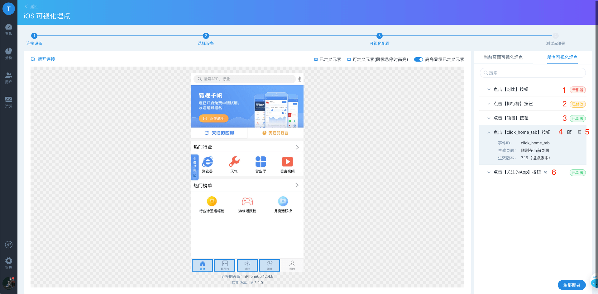

# 可视化埋点

数据接入是使用数据分析平台的第一步，主要包括客户端埋点、服务端埋点和工具导入三类方法。其中，客户端埋点有三种方式：

* 代码埋点
* 可视化埋点
* 全埋点

不同方式有不同的优缺点，也有不同的使用场景，单一的埋点方式显然已经无法满足不同客户的诉求。因此，除了支持代码埋点之外，方舟支持可视化埋点的方式，来减少代码埋点工程师的工作量，同时因其简单灵活、随时发布无需重新发版的特点，能够使得产品、运营等非技术人员能零门槛的根据业务需要直接在页面上定义事件，快速验证，极大提高获取数据的效率。

当然，可视化埋点也有其局限性存在，所以没有哪种方式最好，适合企业分析需要、满足业务需求才是最好的方式。想要了解更多各种埋点的差异，可以阅读方舟博客中[埋点系列文章](https://ark.analysys.cn/blog/%E4%B8%BA%E4%BA%86%E8%AE%B2%E6%98%8E%E7%99%BD%E5%9F%8B%E7%82%B9%E7%9A%84%E6%BC%94%E5%8F%98%E5%8F%B2%EF%BC%8C%E8%BF%99%E5%B8%AE%E6%8A%80%E6%9C%AF%E7%94%B7%E7%8C%AE%E5%87%BA%E5%B9%B4-2)。


暂不支持小程序的可视化埋点


## 使用前准备

开始使用可视化埋点之前，需要经过以下步骤

* 确认已开通方舟可视化端口；
* 按照[ SDK 指南 ](../../../integration/sdk/)正确初始化SDK，并配置可视化连接地址
* 成功回数，进入管理-接入数据管理-可视化埋点，选择相应平台开始。


5.1 版本对可视化模块进行了升级，业内首家支持圈选属性，扩大可视化埋点可采集的数据边界；同时支持选择同级元素、同类型元素等提升埋点效率；

使用 5.1 版本的可视化埋点务必集成 4.5.0 及以上版本的 SDK。



4.3.0 以下版本入口在 **管理 - 元事件** 页面中


移动端和 Web 端可视化埋点流程差异较大，以下将分别说明：

## 移动端 \(Android / iOS \) 可视化埋点

对移动端 APP 进行可视化埋点需要经过 4 个步骤：

1. 连接设备
2. 选取设备
3. 可视化配置
4. 测试 & 部署

### 1. 连接设备

进入到连接设备页面后，在设备上打开您集成了 SDK 的应用，**摇一摇** 开始连接，当超出 3 分钟时间，还没有连接时，需要点击按钮`连接超时，重试连接`后，重新摇一摇连接。


若进入该页面前已经打开了应用，请杀掉进程，重新打开。


### 2. 选取设备

连接成功后自动进入到选取设备页面


若多个手机同时进行摇一摇，方舟会显示多个设备，但同一版本的App同时只能连接一个，所以需要确认当前连接的设备名称和埋点的应用版本号，无误后，点击进入配置页面

当同一台设备连接到两个浏览器页面时 e.g. A 和 B，

* 选择连接了 A 页面上的设备时，B 页面上相同设备会变灰不可被点击；
* 当从 A 页面上点击断开连接时，B页面上也变灰，如需使用，需要重新连接。


### 3-1. 可视化配置 （V5.1 以下版本）

选取相应设备后，进入配置页面，即可看到当前首页上的页面，想要对哪个页面进行埋点，就可以在手机上选择进入哪个页面，点击页面元素即可开始定义事件。

打开高亮显示以定义元素时，即可看到当前页面中，有哪些已部署的事件，哪些是埋点了但未部署的；如果页面上埋点元素过多，相应的也会高亮显示出来很多元素，这时候如果再去创建一个新的埋点事件时，干扰元素比较多，也可以选择关闭高亮显示。

#### **Ⅰ 创建事件**

点击界面上的UI元素，即可弹出创建事件窗口，页面上会标识出当前选中的是哪个元素，以便于进一步校验选中的元素是否是实际想要埋点的元素，通过以下内容来定义该事件：

1. 事件ID：即事件的唯一标识，必填，仅支持字母、数字和下划线组成，且不能以数字开头
2. 事件名称：非必填项，但建议填写，方便在分析时查看
3. 限制条件：用于进一步约束事件，包含
4. 以下两项
   * 限制在当前页面 ：默认时选中状态，取消选中表示应用于所有页面

     > 部分元素会在多个页面上出现，如果需要让所有页面的这个元素被触发时，都上报到这个事件时，可以取消选中，例如，导航。

   * 限制在文本：xyz

     > 部分按钮上文本在不同中情况下会有变化，比如 `体验 Demo`这个按钮在登录前 显示`体验 Demo`，登录后变成`进入我的应用` ，如果要明确监测登录前点击这个按钮的情况时，就可以在登录前的情况下，勾选限制在文本，这时能自动获取到文本：体验 Demo ，用户只有点击 体验 Demo 的情况下，数据才会上报到定义的事件中。
5. 生效版本：默认仅当前版本生效

   > 随着版本迭代，有些元素可能在新老版本上有差异，支持选择仅在当前版本生效；当所定义的元素，在所有版本上都存在，且想要监测所有版本上，该元素的点击情况，则可以选择全部版本生效。

_点击确认，即可保存，但此时埋点的事件仅在调试设备上生效，只有部署后才对所有设备生效_。

#### **Ⅱ 可视化埋点列表**

已经保存和部署的埋点都会显示在右侧列表中，当前页面可视化埋点和所有可视化埋点可以切换查看，列表显示：

* 事件部署状态，移入后标识提示：已部署 / 未部署 / 已修改未部署
* 事件名称，当没有填写事件名称时，会显示事件 ID
* 点击事件名称展开下拉展示更改信息：包括事件 ID、限制条件、生效版本

支持搜索关键词根据事件ID 、事件显示名称模糊搜索

#### **Ⅲ 修改埋点**

移入事件后，点击修改，打开编辑弹窗。

> 注：当前仅能在埋点的版本上对事件编辑和删除

确定修改后，埋点状态会变成已修改，修改需要部署后生效。

#### **Ⅳ 删除埋点**

当删除未部署事件时，直接删除；

当删除已部署事件时，需要部署后才可以生效。

### 3-2. 可视化配置 （V5.1 及以上版本）

选取相应设备后，进入配置页面，即可看到当前首页上的页面，想要对哪个页面进行埋点，就可以在手机上选择进入哪个页面，点击页面元素即可开始定义事件。

#### **Ⅰ 创建事件**


移动端可视化埋点支持大部分的控件，详见

* [Android 支持控件](https://docs.analysys.cn/features/project-manegement/data-integration/virtualizer#1-android-zhi-chi-kong-jian)
* [iOS 支持控件](https://docs.analysys.cn/features/project-manegement/data-integration/virtualizer#2-ios-zhi-chi-kong-jian)


若鼠标滑过控件显示出可圈选标识（蓝框），则表示该控件可进行埋点。点击控件，显示“编辑中”，右侧框中即可进行事件定义。

可通过以下内容来定义该事件：

1. **事件ID：**即事件的唯一标识，必填，仅支持字母、数字和下划线组成，且不能以数字开头
2. **事件名称：**非必填项，但建议填写，方便在分析时查看
3. **事件属性：**支持手动输入值，或者从页面上圈选
   * 属性ID：即属性key，支持以字母开头的字符串，必须由字母、数字、下划线组成，字母不区分大小写
   * 属性值：支持手动输入和从页面中选择
     * 手动输入值：即固定值，将按照填写内容上报
     * 从页面选择：支持圈选和圈选后正则提取，圈选可从页面中获取控件内容，正则提取可过滤文本中的数值，也可自定义正则提取内容
   * 属性类型：可指定当前属性value的上报类型，比如价格，数值型；名称，字符串
4. **生效范围-圈定元素：**页面上每个可点击的位置都被视为元素，通过选择元素来圈定当前定义的事件生效范围，即点击哪些位置会上报定义的事件，可选择项：
   1. **当前文本**：指定内容，不区分元素类型，当文本发生变化时，埋点失效。 一般用于给某个特定内容文本埋点， 比如： 圈中按钮上的文字【登录】，当仅选择当前文本时，如果页面上有个非按钮的链接也叫【登录】，则在两处触发点击时，都会上报该事件。 
   2. **当前位置：**指定位置的元素，当内容发生变化时，埋点仍然有效，页面结构发生变化时，埋点失效。 一般用于给某个特定位置埋点。 
   3. **同级元素：**指与埋点元素的所有父级元素标签类型及元素个数相同的元素，一般用于给列表埋点，可以添加属性，区分同级别但不同内容的元素。 
   4. **同类型元素：**指与当前埋点元素的Class属性值相同或包含当前埋点元素的Class属性值的元素，点击相同类型的元素时会上报同一个事件，通常可以添加属性，区分同类型但不同内容的元素点击数据。 四个选项可以结合使用， 比如： 可选择当前位置+当前文本来给特定位置上的特定内容埋点 可选择当前文本+同类型元素来给相同控件相同名称的
5. **生效范围-生效页面：**用于确定埋点生效的页面范围，包括选项：
   1. **当前页面：**指仅在当前页面\(URL\) 点击相应元素才触发上报该事件
   2. **全部页面：**指在所有接入SDK的页面中点击相应元素，都触发上报该事件。比如有非常多的商品详情页，每个页面上都有【加入购物车】按钮，即可选择全部页面，那在任何详情页上点击加入购物车，都会上报到同一个事件中，方便统计分析。
6. **生效范围-生效版本：**用于确定埋点生效的版本，包括选项：
   1. **当前版本**：指当前可视化埋点连接的应用版本
   2. **全部版本：**指所有版本，随着版本迭代，有些元素可能在新老版本上有差异，支持选择仅在当前版本生效；当所定义的元素，在所有版本上都存在，且想要监测所有版本上，该元素的点击情况，则可以选择全部版本生效。


当App端切换页面或UI界面发生变化时，App端重新上传数据，方舟前端页面将会重绘；

若此时某个控件处于“编辑中”状态，则会提示“是否放弃当前自定义的事件”，如下图，点击是，则放弃埋点信息并载入最新页面信息；点击否，则继续编辑埋点信息；


信息填写完成后，点击右下角“确定”按钮，埋点信息将会同步至App端，此时点击App对应的控件，则会在方舟中回显埋点信息，如下图灰色弹窗


只有对当前设备App版本生效的埋点才有回显，如果埋点生效版本不包括当前App版本，则不会触发回显。

当前点击“确定”后，仅表示在可视化连接状态下生效，若要实际生效，需点击“部署”。


#### **Ⅱ 可视化埋点列表**

已经保存和部署的埋点都会显示在右侧列表中，当前页面可视化埋点和所有可视化埋点可以切换查看，列表显示：

* 事件部署状态，移入后标识提示：已部署 / 未部署 / 已修改
  * 未部署：红色，埋点仅在可视化连接状态下生效
  * 已修改：黄色，修改了已部署的控件，需部署后生效
  * 已部署：绿色，当前为生效状态
* 事件名称，当没有填写事件名称时，会显示事件 ID
* 点击事件名称展开下拉展示更改信息：包括事件 ID、生效页面、生效版本
* 移入事件出现操作选项，进行编辑或删除

在右侧埋点列表中可通过搜索功能快速查找已埋点信息，可对“事件ID”和“事件名称”进行快速查找。

#### **Ⅲ 修改埋点**

修改埋点控件信息的两种方式：

* 点击左侧截图中已埋点控件
* 右侧埋点列表中，将鼠标悬停在某一条埋点上，若显示“编辑”图标，点击即可


注意：

1. 已部署埋点不可修改事件ID
2. 已回数据的属性ID、数据类型不可修改
3. 若修改控件为“已部署”，编辑后展示为“已修改”状态
4. 修改完点击“确定”，确定后仅表示在可视化连接状态下生效，若要断开生效，需使用“部署”功能
5. 部分“闭眼睛“图标标识的事件无法编辑，可能原因是：
   1. 当前页面实际有埋点，但是隐藏元素，需要操作后可见,比如弹窗 
   2. 当前页面实际有埋点，但不在当前可见范围，需要上滑或下滑操作后出现 
   3. 当前页面实际有埋点，但该版本不可见，需要在实际生效的版本编辑 
   4. 当前页面实际没有埋点，但因为选择了全部页面生效而出现，需要在实际生效的页面编辑


#### **Ⅳ 删除埋点**

右侧埋点列表中，将鼠标悬停在某一条埋点上，会显示“垃圾篓”图标，点击即可删除


注意：

1. 若埋点未部署，则会直接删除，无提示
2. 若埋点已部署，则会提示“您确定删除xxx事件吗？”的提示信息，点击“确定”即可删除
3. 若要删除后其他App生效，则需重新点击“部署”按钮


### 4. 测试 & 部署

点击 APP上已经埋点的位置，即可弹出埋点日志信息，用于验证埋点是否生效。

验证完成后可以进行部署，通过切换当前页面埋点 / 全部页面埋点 来确定是仅部署当前页面埋点，还是部署全部页面埋点

部署完成后，1分钟后生效，即用户在1分钟之后触发埋点的事件，即可上报数据。


埋点生效时间在安装方舟时可配置，原默认5分钟，V5.1 开始默认1分钟


当测试完成，即可点击**部署**， 部署成功后，用户下次启动时，获取埋点规则，触发即可上报事件。


1. 在可视化埋点的过程中，应用退到后台、网络状态比较差 、手机锁屏时，无法全选，页面胡遮罩提示，当重新连上时，恢复屏显；在网络不稳定、锁屏等情况下，可能会存在意外断开连接的情况，需要返回重新连接。
2. 可视化埋点测试模式下上报的数据平台，是否加入到正式数据中取决于debug属性的值


## Web / H5 可视化埋点详情页

Web / H5 可视化埋点需要 3 个步骤：

1. 选择要埋点的页面 
2. 可视化配置 
3. 测试 & 部署

### 1. 选择要埋点的页面

输入需要进行可视化埋点的页面

### 2. 可视化配置

确认后的地址后即可进入可视化配置页面


当出现以下情况时，无法圈选埋点

1. 页面没有集成方舟 SDK
2. 集成的 AppKey 不正确
3. 网站禁止了 iframe 的加载


#### A 收起导航

可以收起左侧导航，使得页面大小符合原页面大小，更精准的埋点；再次点击即可展开导航

**B 模式切换**

移动端可视化埋点定义时是在Web端，测试点击和切换页面是在APP端；但 Web 端定义埋点、点击触发、交互都只能在 Web 页面上， 所以进行不同操作时，需要切换模式来区分

* **定义模式：**点击元素可以进行埋点
* **测试模式：**点击埋点元素即可查看返回日志
* **可交互模式：**点击元素可以进行实际的交互，比如跳转页面、打开弹窗等等，点击后可以对新的页面进行可视化

**C Web 和 H5 模式切换**

因为对于部分 H5 页面，显示在 Web 端时，会和实际样式不一样，可以选择 H5 项，使得页面显示更符合实际情况

#### D 切换页面

可以输入要切换的页面 URL，点击→ 切换页面

#### E 元素状态标识

#### F 埋点事件列表

点击埋点事件列表可以查看当前页面和所有页面可视化埋点，进行修改和删除

#### G 一键部署

点击后会部署所有未部署的埋点。


创建埋点事件、修改和删除同移动端，不一一说明。


### 3. 测试 & 部署

切换到测试模式，点击埋点元素即可查看返回日志。

## 常用场景举例

### **1** 基础事件埋点

**场景**

统计用户点击“首页”按钮操作，点击时上报事件为“click\_home\_tab”。

**埋点步骤**

1. 点击“首页”按钮
2. 右侧“添加事件”-&gt;“定义事件”中“事件ID”输入“click\_home\_tab”，“事件名称”可输入“首页”方便阅读
3. 点击右下角“确定”按钮
4. 此时控件生效范围仅限于“当前位置”“当前页面”“当前版本”，若有需求可变更“生效范围”选项

**检查并部署**

* 检查：手机App点击“首页”按钮，若方舟可视化前端展示回显框，则检查回显框中“事件ID”是否为“click\_home\_tab”，若是，表示埋点成功
* 部署：若要埋点在生产环境生效，则需点击“部署”或“全部部署”

### 2 事件属性埋点

**场景**

统计用户登录事件“click\_login\_action”，并添加一个固定属性值“action”值为“登录事件”，再获取当前登录用户名称“loginAccount”。

**埋点步骤**

1. 点击“登录”按钮
2. 右侧“添加事件”-&gt;“定义事件”中“事件ID”输入“click\_login\_action”，“事件名称”可输入“登录”方便阅读；“事件属性”模块中，点击“添加属性”，可添加一条属性信息
   * 第一条：固定属性信息，“属性ID”填写“action”，“属性值”选择“手动输入值”，并填写属性值“登录事件”
   * 第二条：获取属性信息，“属性ID”填写“loginAccount”，“属性值”选择“从页面选择”，并点击“圈选属性”小手，此时鼠标状态改变，可在页面中选择需要获取控件的文本信息，当鼠标移至控件会变为橘黄色，选中后，在属性值框输入框中将会展示控件内容，表示获取成功
3. 点击右下角“确定”按钮
4. 此时控件生效范围仅限于“当前位置”“当前页面”“当前版本”，若有需求可变更“生效范围”选项

**检查并部署**

* 检查：手机App点击“登录”按钮，若方舟可视化前端展示回显框，则检查回显框中“事件ID”是否为“click\_login\_action”，自定义属性中是否包含“action”字段值为“登录事件”，“loginAccount”字段为用户输入参数
* 部署：若要埋点在生产环境生效，则需点击“部署”或“全部部署”

### 3 复用列表埋点

由于页面做法不同，需先确认当前埋点控件是否为可复用列表，可通过以下方式：

* 通过开发人员确定是否为复用列表
* 进行可视化埋点时，“生效范围”仅勾选“同级元素”，若当前页面圈选元素出现多个虚线框控件，则表示为复用列表

**场景**

统计用户点击排行榜列表中的单条数据事件“rank\_list”，并获取当前点击行中App的名称“app\_name”

**埋点步骤**

1. 点击复用列表中的某一行（当前埋点行为实线框，同级控件行为虚线框）
2. 右侧“添加事件”-&gt;“定义事件”中“事件ID”输入“rank\_list”，““事件名称”可输入“排行榜列表”方便阅读；“事件属性”模块中，点击“添加属性”，可添加一条属性信息
   * 获取属性信息，“属性ID”填写“app\_name”，“属性值”选择“从页面选择”，并点击“圈选属性”小手，此时鼠标状态改变，可在页面中选择需要获取控件的文本信息，当鼠标移至控件会变为橘黄色，选中后，在属性值框输入框中将会展示控件内容，表示获取成功
3. “生效范围”-&gt;“圈定元素”，仅勾选“同级元素”，此时，页面会将同级元素使用虚线框标注
4. 点击右下角“确定”按钮，同级元素将全部显示为埋点状态
5. 此时控件生效范围仅限于“当前页面”“当前版本”，若有需求可变更“生效范围”选项

**检查并部署**

* 检查：手机App点击复用列表中的某一行，若方舟可视化前端展示回显框，则检查回显框中“事件ID”是否为“rank\_list”，自定义属性中是否包含“app\_name”字段值为对应行中文本信息
* 部署：若要埋点在生产环境生效，则需点击“部署”或“全部部署”

## **附：可视化埋点支持的控件**

### **1. Android 支持控件**

可点击控件均可以进行圈选埋点，具体包含如下：

| 控件描述 | 控件类型 | 备注 |
| :--- | :--- | :--- |
| 视图 | View |  |
| 文本显示 | TextView |  |
| 按钮 | Button |  |
| 线性布局\(布局容器\) | LinearLayout |  |
| 列表 | ListView,RecyclerView |  |
| 图片展示 | ImageView |  |
| 九宫格等 | GridView |  |
| 文本编辑 | EditText |  |
| 网页展示 | WebView | 支持H5元素圈选 |

### **2. iOS 支持控件**

包含如下：

* 继承至UIControl的控件，如：UIButton（按钮）、UIPageControl（页码控件）、UISegmentedControl（分段控件）、UISlider（滑块控件）、UISwitch（开关控件）、UIStepper（步进器）
* 添加了 UI TapGestureRecognizer手势的可点击视图
* 可复用列表中的cell条目，如：UITableView中的UITableViewCell、UICollectionView中的UICollectionViewCell

| 控件描述 | 控件类型 | 备注 |
| :--- | :--- | :--- |
| 按钮                              | UIButton                            |  |
| 分段控件 | UISegmentedControl |  |
| 滑块控件 | UISlider |  |
| 开关控件 | UISwitch |  |
| 页码控件 | UIPageControl |  |
| 步进器 | UIStepper |  |
| 复用cell | UITableViewCell |  |
| 复用cell | UICollectionViewCell |  |
| 网页展示 | WKWebView | 支持H5元素圈选 |

## FAQ

### 1. 摇一摇没有展示当前设备

* 确认App是否已集成易观方舟SDK，并设置可视化相关接口
* 检查方舟项目中的AppKey与SDK设置的是否为同一个
* 当前手机是否可访问方舟后端可视化端口
* 方舟端：进入“等待设备接入”状态，App端：等待App完成启动后，再进行摇一摇，否则可能不生效
* 若第一次未生效，可杀死App并刷新方舟可视化前端页面，重新进入App摇一摇尝试连接

### 2. 埋点过程中突然断网，埋点怎么办

* 此种情况可能发生在网络不稳定或移动wifi网络切换过程中
* 添加事件中已点击确定的埋点，将不受影响
* 若当前埋点处于编辑中，系统将会丢失

### 3. App发版，原有的埋点是否生效

* 生效的范围限制包括：元素限制（当前内容、当前位置、同级元素、同类元素），页面限制（当前页面、所有页面），版本限制（当前版本，所有版本）。
* 若已埋点控件的页面结构改变，但仍符合元素限制（如：根据当前内容圈选），页面限制和版本限制都满足则原有埋点生效
* 若已埋点控件的页面结构未改变，需关注埋点时选择的“生效范围”限制，如：埋点时限定了1.0版本生效，当前App升级为2.0，则埋点不会生效，若要生效可选择“全部版本”；若埋点时限定了文本内容为“首页”，当前版本改为了“我”，则埋点不会生效。

### 4. 同一个位置的控件在iOS端可埋点，但Android端无法埋点

* 系统差异、控件差异、开发人员习惯等，使得页面看上去相同，但实际控件可能无法埋点，如果圈选表现不一，可联系自己的开发人员咨询、核对控件在不同系统、机型的表现，更改埋点方案实现需求

### 5. 同一个App，相同的控件类型，有的能响应事件，有的不能响应事件

* 可能由于系统升级导致原生控件图层发生变化，导致无法匹配控件
* iOS端：只有控件添加了事件响应才会允许埋点，对于无触发事件控件埋点无意义
* Android：控件可埋点的前提是可点击

### 6. 埋点列表中显示了很多不是当前App的埋点

* 目前可视化只是做了AppKey和设备类型的区分，若其他App进行可视化埋点时使用的AppKey和设备类型与当前设备相同，则会同时显示
* 建议不同的App使用不同的方舟项目（即Appkey不同，要进行关联一起计算的除外）

### 7. 页面已切换，但当前页面的埋点列表没有更新，还会显示其他页面的埋点

* 当前页面可视化埋点，是从代码层面的相同页面。当页面展示不同，可能并没有真正切换页面，如：相同的ViewController，或者有些跨平台框架应用只有一个页面等。
* 若埋点控件“生效范围”选择“全部页面”，则该埋点会出现在所有页面列表中
* iOS端：使用控制器类名作为页面标识，若多个页面使用同一个类生成则认为是同一个页面
* Android端：使用activity，dialog，popup window等作为页面标识

### 8. 更改生效版本后，之前的版本在生效列表不再显示

* 生效版本的列表只显示生效版本、当前版本、和全部版本。
* 当生效版本和当前版本是同一个，只会显示当前版本和所有版本，不会显示所有App的版本

### 9. 页面切换或显示改变，回显框一直显示

* 回显中可能包含多个自定义属性，为防止不同用户查看速度不同，回显信息目前使用人工手动关闭式

### 10. 部署埋点，断开可视化连接，发现埋点数据未上报

* 部署埋点存在数据同步机制，刚部署的数据大约五分钟左右生效默认5分钟，安装方舟时候可配置（方舟5.1版本开始默认1分钟）
* 断开可视化后，建议杀死App，重新启动拉取埋点信息
* 检查手机网络是否正常，若网络存在问题，可能导致埋点数据并未拉取到
* 可通过网页访问已部署数据
  * 可视化部署地址 + AppKey+appVersion+lib
  * 可视化部署地址为`VisitorConfigURL`设置的地址，AppKey为项目标识，appVersion为App版本号，lib：苹果端为iPhone，安卓端为Android。如：`http://192.168.1.1:8089/configure?appKey=523rwe8e7fe4e60&appVersion=1.0&lib=iPhone`或`https://192.168.1.1:8089/configure?appKey=523rwe8e7fe4e60&appVersion=1.0&lib=Android`

### 11. Hybrid埋点，页面内容显示与App显示不一致

* 当出现显示不一致可能是H5的页面结构缺陷，重绘是根据页面结构重绘的，虽然实际表现正常，但内部不完善，例如塌陷等，此时根据位置信息重绘的确会出现偏移，但是不会影响正常埋点。

### 12. 埋点属性个数是否有限制

* 事件属性分为两种，一种为固定属性，即：手动输入属性k-v对，这种数量无限制；一种为从页面选择属性，这种关联属性目前最多可关联5个
* 不建议添加过多自定义属性，尤其是“从页面选择”属性，此类属性在App端需要进行查找，可能会影响效率，另一个可能会增加事件分析的复杂性

### 13. 埋点删除后，数据依然上报

* 在埋点列表删除埋点后，需点击部署，生产环境或其他App才会生效
* 埋点列表已部署，但由于网络问题导致新部署可视化数据未能同步至App端，导致删除数据依然存在

### 14.摇一摇问题排查

* iOS：用Xcode运行要连接的App，打开Debug，摇一摇查看日志打印
* Android：用Android Studio运行要连接的App，打开Debug，摇一摇查看日志打印

### 15.同类元素和同级元素的差异

同类元素：指控件类型相同，如：当前页面的所有按钮都是同一个类型，所有输入框都是同一个类型，所有的单选框都是同一个类型

同级元素：该概念在可视化埋点中仅存在于复用列表控件。由于这些控件是复用的，所以他们的布局样式一致，控件的层级嵌套也是一致的，为了避免重复埋点的工作，可限定同级元素埋点，这样只要布局样式相同的控件都可生效

复用列表的特点：

* 通常可以无限上下滑动
* 在圈选埋点时，若包含同级元素，则会以虚线框形式进行标注
* 每一块的布局相同，如：微信朋友圈列表，常见样式上半部分一段文字，下半部分为九宫格图片，他们布局一致；也可能包含多种样式，如：左边图片右边文字，上边图片下边文字等等


以上内容没有解答我的问题？[点击我来反馈](https://support.qq.com/products/118522/) 🚀


