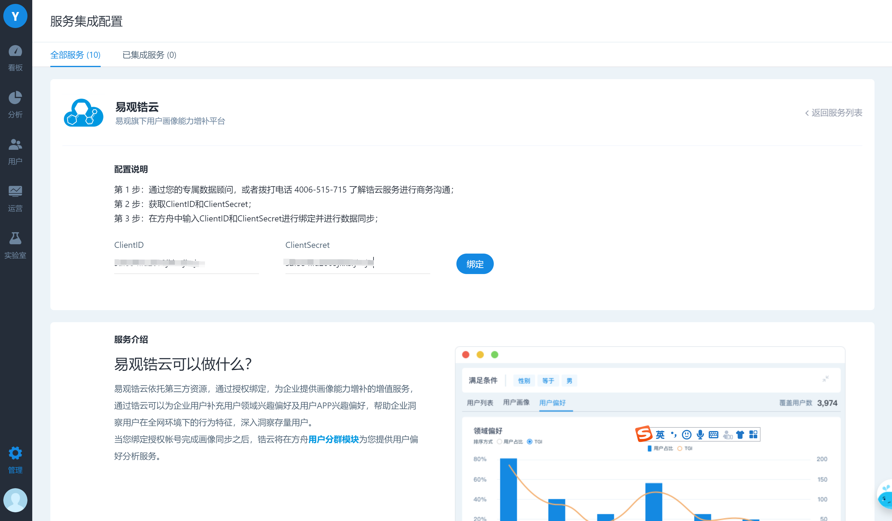

# 服务集成配置

易观方舟一个开放的生态平台产品，旨在为客户提供更全面的能力，满足业务需求。方舟产品支持客户接入原有使用的服务提供商，持续获得服务。同时，与方舟本身提供的功能形成合力，达到更显著的运营效果。

目前已经接入的服务有：

* 消息通知
* 邮件
* 短信
* 数据服务

后续，将会有更多的外部服务接入方舟产品，共同为客户创造更大价值。

## 接入配置

进入管理导航，选择服务集成配置，点击进入即可看到目前所支持的所有外部服务商：

根据服务类型，选择想要接入的服务商，点击接入配置，进入配置页面；按照配置说明填写相应的信息即可，此章节以易观锆云为例进行配置说明，需注意不同服务商的配置会有所差异，请根据各服务配置页面提示进行配置。

#### 易观锆云配置示例

step 1

进入管理导航，选择服务集成配置，进入服务列表。

step 2

找到易观锆云，点击接入配置，进入配置页面。

step 3

已有账户可直接数据相应的账户信息进行绑定；无账户用户请根据页面提示联系客服进行账号申请，获取账号信息后到配置页面进行配置。

step 4

配置完成后，进入已集成服务，找到易观锆云，点击画像同步，进入同步页面。在该页面可以查看当前可同步画像内容的设备数、剩余匹配设备条数以及匹配记录。点击立即同步按钮，进行画像同步。待同步完成后即可在用户分群中使用用户偏好功能。

