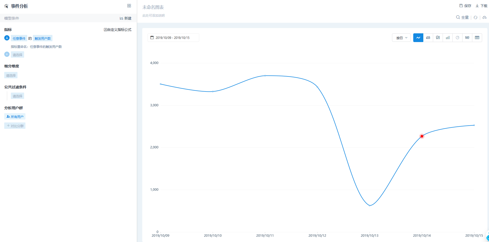

# 智能监控


智能监控功能的使用需要相应方舟版本： 

v4.5.0及以上


在客户完成埋点方案上报元事件后，针对关注的指标会通过自定义监控跟踪其异常情况；但是往往在其他没有关注事件中，也会有异常波动不被发现。

因此，智能监控可以对启用中所有元事件的每天触发次数和触发人数进行监控，并根据相关算法预测出当日事件的触发次数和触发人数，和实际值进行对比后，如果超过阈值范围会进行告警消息提醒。

## 1管理智能监控

点击【管理】-【监控告警】-【智能监控】进入智能监控管理界面，可以设定单条监控指标的阈值范围和订阅状态，也可以点击【取消全部订阅】，一键取消所有监控。

| 监控阈值范围 | 预测值范围上下浮动 |
| :--- | :--- |
| 严格 | +/-10% |
| 中等 | +/-30% |
| 宽松 | +/-50% |

## 2 查询告警消息

通过点击触发的告警消息的【查看详情】按钮，可以进入事件分析，在图表中查看具体异常点和预测值区间，并通过细分维度等方式快速找到异常原因，从而采取有效改进措施。

