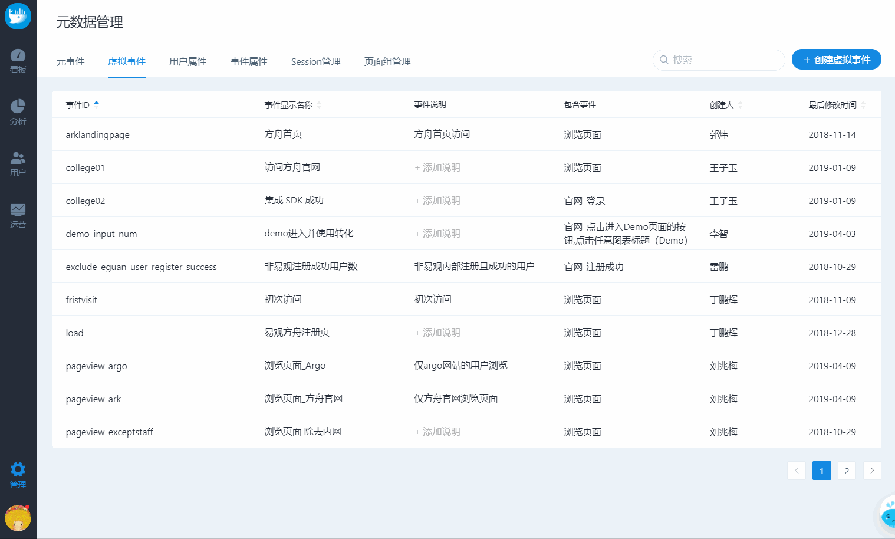

# 虚拟事件

在上报的元事件无法直接满足分析需求，又无法更改埋点时，经常会用到虚拟事件。

虚拟事件可以组合多个元事件，每个元事件下也可以设置过滤条件。


常见使用场景：

**1 同含义的按钮埋了多个事件，分析时想要合并分析**

e.g. 多个页面都有加入购物车按钮，一个是 add\_to\_cart1，一个是 add\_to\_cart2，想要的分析总的加入 购物车的情况时，就可以将二者组合为一个事件 。

**2 同类元素在上报时为了方便抽象为同一个事件，但是分析时想要拆开，快速查看**

e.g. 所有页面上报的事件都是 $pageview，但分析时想要定位到具体的一类页面，尽管在分析模块中通过添加条件也可以实现，但每次选择时都需要重复添加，比较低效；这时就可以选择该事件的，通过添加条件创建虚拟事件来实现。


## 1 创建虚拟事件

点击列表有右上角创建虚拟事件，输入事件ID、显示名称、事件说明和虚拟事件的构成即可。


选择了多个事件时，事件之间是或的关系

假如`虚拟事件 X` 由 `事件A` 和  `事件B` 组成，那么其含义就是只要用户触发了`事件A` 或者 `事件 B` ，都算是发生了 `虚拟事件 X`


## 2 管理虚拟事件

移入已创建的虚拟事件，可以进行修改和删除


删除虚拟事件并不会删除元事件，但会让已创建的引用了该事件图表无法正常显示


## 常见问题

### **1 虚拟事件的数量有上限么？**

没有。虚拟事件只是规则，不需要额外计算和存储。


以上内容没有解答我的问题？[点击我来反馈](https://support.qq.com/products/118522/) 🚀


