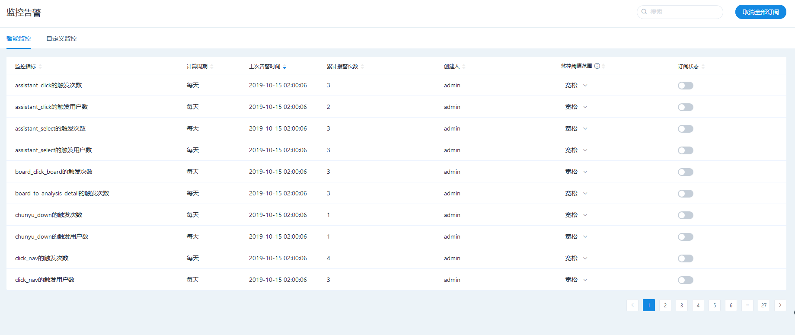

# 智能监控


方舟版本 V 4.5.0及以上具备此功能。


## 运用场景

自定义监控由于需要手动设定，往往只能覆盖小部分指标，但那些未被设定的指标中也常会发生值得关注的异常。

这时，就可以通过智能监控来覆盖更多的事件。智能监控可以对所有启用事件的每天触发次数和触发人数进行监控，并根据相关算法预测出当日事件的触发次数和触发人数，和实际值进行对比后，如果超过阈值范围则会通过站内消息及邮件的方式进行告警。

## 具体功能

### 管理智能监控

点击【管理】-【监控告警】-【智能监控】进入智能监控管理界面，可以设定单条监控指标的阈值范围和订阅状态，也可以点击【取消全部订阅】，一键取消所有监控。

| 监控阈值范围 | 预测值范围上下浮动 |
| :--- | :--- |
| 严格 | +/-10% |
| 中等 | +/-30% |
| 宽松 | +/-50% |

### 查询告警消息

通过点击触发的告警消息的【查看详情】按钮，可以进入事件分析，在图表中查看具体异常点和预测值区间，并通过细分维度等方式快速找到异常原因，从而采取有效改进措施。

## Q&A

#### 该预测的算法是基于什么原理？

基于常用的天周期粒度，考虑时间序列的周期性和趋势性两个方面，并根据通用行业历史真实数据和预测数据对比，当前算法模型的预测准确率达到80%，具体模型计算方法如下：

 预测数据=（工作日过去12期平均值+周平均值）/2 

示例如下图: 

预测本周二数据，周平均值=本周一至上周二的平均值

工作日过去12期平均值=过去12个星期二的平均

#### 预测基于的过去多久的历史数据？

基于过去12周的历史数据，通过算法模型预测出最终结果。

#### 该预测是否根据不同行业有不同的针对性？

该预测模型基于通用行业数据和预测数据对比，准确率达到80%；也可以根据您所在行业调整每一条监控的阈值范围：严格（预测值的+/-10%），中等（预测值的+/-30%）和宽松（预测值的+/-50%），从而达到您最终的监控要求。

#### 会不会把我的数据分享出去？

针对公有云客户，我们采用行业内通行的、合理的标准来保护我们所储存的信息的安全性和保密性。包括但不限于：防火墙和数据备份措施；数据中心的访问权限限制等。整个服务过程中，我们会签署一份保密协议，付费版有单独的NDA，免费版在使用协议里，对您的数据进行严格保密。 针对私有化部署客户，数据存储在客户本地，更不用担心数据分享的问题。

#### 该功能未来有什么规划？

未来为了让您发现异常点后，更加快捷的找到异常原因，我们也会探索智能下钻相关功能，让智能监控模块使用更加方便。

#### 针对管理员和其他非管理员该功能使用有什么差别吗？

管理员可以最终控制每条监控的开关，即管理员关闭一条监控，所有成员都收不到该条监控的告警。 

而其他非管理人员，可以关闭针对其个人的告警消息提醒，但是不能干预其他人的设置。

