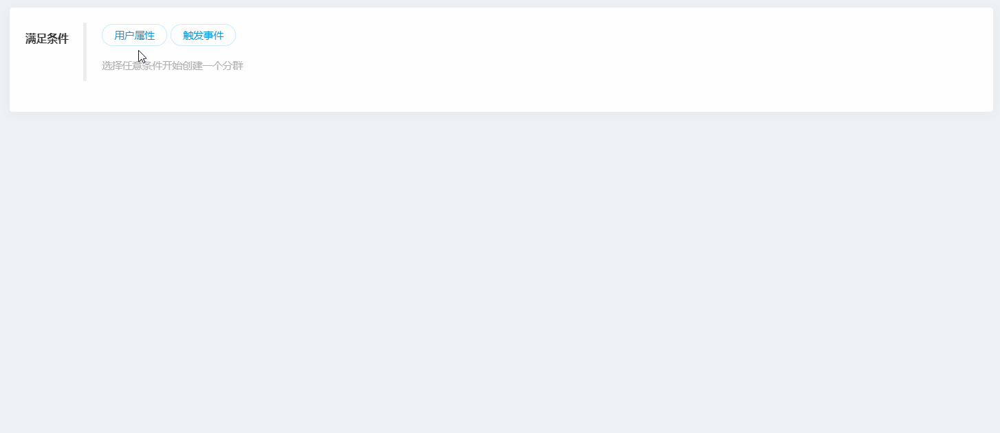
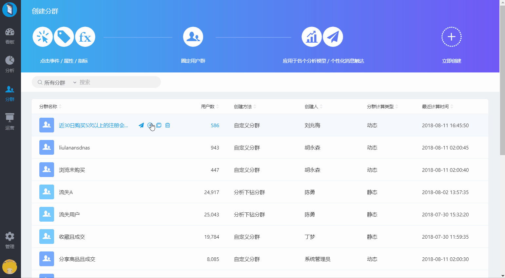

# 用户分群

用户分群即将用户标签化，把具有相同特征 / 行为的用户进行聚类，是精细化运营的基础。在后续分析中可对比分析不同人群同一指标的表现，发现背后的影响因子，指导产品优化方向，或者针对不同的用户群匹配不同的服务和内容，进行个性化运营。

## 1 创建分群

系统当前支持通过两种方式创建用户分群：

### 1.1 分析模型下钻保存分群

在分析模型中将任意数据节点上的用户保存为一个用户群。例如，在漏斗的某个步骤时，可以把某个关键路径流失的人群保存下来，进一步在其他分析模型中分析这个用户群的行为和特征。

### 1.2 自定义**行为/属性条件创建分群**

在分群列表中的点击 “ 立即创建” 进入自定义创建的页面

#### **1.2.1 设置分群规则**

可以通过用户 **触发的事件** 和 **用户属性** 来细分人群


如果您开通了用户标签功能，则在创建分群时，可在用户属性中选择您创建的标签体系，进行分群的创建，如未开通用户标签功能的用户则用户属性中仅包含您上报的属性信息。


选择 **触发事件** 时是通过事件或事件属性构成的指标作为条件来过滤的，例如 ：启动的次数 &gt; 1 或着 支付订单的 支付金额的总和 &lt; 10000

条件之间支持 **与**、**或**、**非** 的关系，例如：在北京或上海，近30天内首次下单 且 订单金额 ≥ 3000 的 非注册用户**。**

**1.2.2 预览分群**

在配置完成分群条件之后，可以点击预览，查看满足该条件用户的详细情况。系统支持用户自定义选择展示的用户属性，帮助校验分群条件准确的选中了目标人群。

#### 1.2.3 保存分群

如果需要将选择的分群添加到看板、分析中进一步分析或者触达时，可以保存分群

支持两种类型：

**A 静态分群**

仅在创建分群时计算一次

创建固定的用户群时，可以选择该类型，比如仅选择用户ID为 11、23、345 的三个用户

**B 动态分群**

根据分群条件每天例行计算

创建想要跟随时间动态更新的分群时，可以选择该类型，比如在动态时间范围内满足某些行为（e.g. 近7日启动次数大于7次）、具备某些用户属性（e.g. 年龄小于18岁、用户等级=vip ）的用户群


当创建分群时选择了固定的时间段，比如2020/01/02 - 2020/04/01 期间启动次数大于7的用户，即使选择了动态分群，时间窗口不会跟随变化；计算人数只有在创建至计算的时间期间里有 2020/01/02 - 2020/04/01 这段时间的日志补发上报时，才可能会变化


**设置分群权限**

在保存分群时，可以快速的进行分群的权限设计，如果您创建的分群仅希望自己使用，则取消项目内成员可见，如在选中状态下保存，则所有项目下用户都能使用您创建的分群。如果想要将分群分享给其他项目成员查看，则进入分群列表，选择分享进行设置。

## 2 编辑分群

### 2.1 修改分群 

对于自己创建的分群，可以直接从列表中点击进入已有分群编辑，保存

对于其他成员创建的分群，可以修改条件另存为自己的分群

> 下钻保存的分群目前不支持修改

### 2.2 删除分群 

对于自己创建的分群，可以移入列表中进行删除；其他成员创建的分群，不支持删除

## 3 分群的应用

创建好的分群可以进一步推送消息、推送到第三方平台、添加看板、导出、另存为、应用于分析图表

### 3.1 推送触达 

对于每个细分人群均可直接进行触达，进行消息通知、电子邮件和短信通知

### 3.2 推送到第三方平台 

对于部分推送平台每个细分人群支持直接推送到第三方推送平台

### 3.3 添加到看板 

每个细分人群可以作为指标添加到看板中进行日常监控，在看板中也可以进一步查看分群详情。

### 3.4 导出 

对于以下场景，支持导出分群

* 导入到广告平台发送广告
* 导入到短信平台发送短信
* 导入到邮件系统进行EDM
* 导出后统计、对数等

默认导出用户ID，根据需要支持自行选择导出的字段。

### 3.5 另存为 

当需要基于当前分群增删改部分条件创建新的条件时，可以选择另存为分群后修改条件再次保存。

### 3.6 在分析模型中对比分析 

每个细分人群都可以在任意模型中再次分析。

