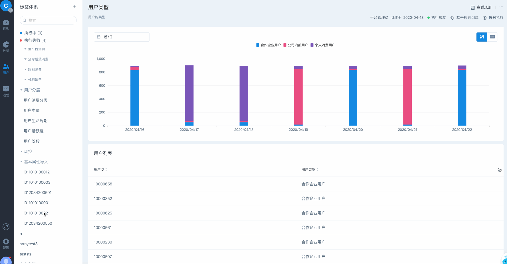

# 标签管理

## 1 标签体系管理

在用户标签中，可以自定义标签体系的结构，以标签树的形式展示、管理具体的标签。

###   1.1 新增标签分类

目前标签体系支持最大三级结构，可在标签体系中通过新增分类，任意创建标签分类用于组织不同部门、业务以及用途的标签。创建时可以选择标签分类所在的层级。

### 1.2 编辑标签及分类

对于已经创建的标签分类及标签，可以通过编辑功能随时的调整标签分类、标签的名称及层级。任意移动到指定的层级目录下。

### 1.3 删除标签及分类

可以直接在标签体系中对标签分类及标签进行删除操作。


在执行删除前需要确认该分类下没有标签，在分类存在标签的情况下无法进行删除，需要将分类下标签移除后方能删除该标签分类。


## 2 标签管理

完成标签体系、标签创建后，可以在标签体系中查询或选择具体的标签进行查看、管理。

### 2.1 标签加工统计

在标签数点击具体的标签，可以查看该标签的历史加工状况，包含每次计算时覆盖的人数以及各标签值之间的占比情况。支持直接选择历史某个标签取值的用户保存为分群。

### 2.2 查看标签定义

通过标签详情页可以查看关于标签的具体定义，包含标签名称、说明以及创建人、创建时间、执行状态、加工类型以及更新周期。

### 2.3 查看标签规则

点击查看规则，可以查看当前标签的加工规则以及规则的变更历史。

### 2.4 编辑标签

对于有标签编辑权限的用户，选择修改，可以进入标签的编辑页面，修改当前标签的基本配置及加工规则，修改完成进行保存后，会按照新的规则进行加工。

### 2.5 管理标签任务

进入标签任务管理页面，可以管理选择标签的历史加工记录，支持重新计算最近一次的加工任务以及删除历史保存的标签记录。

### 2.6 删除标签

点击删除可以对选中标签进行删除，删除后将清空所有已保存的记录。

