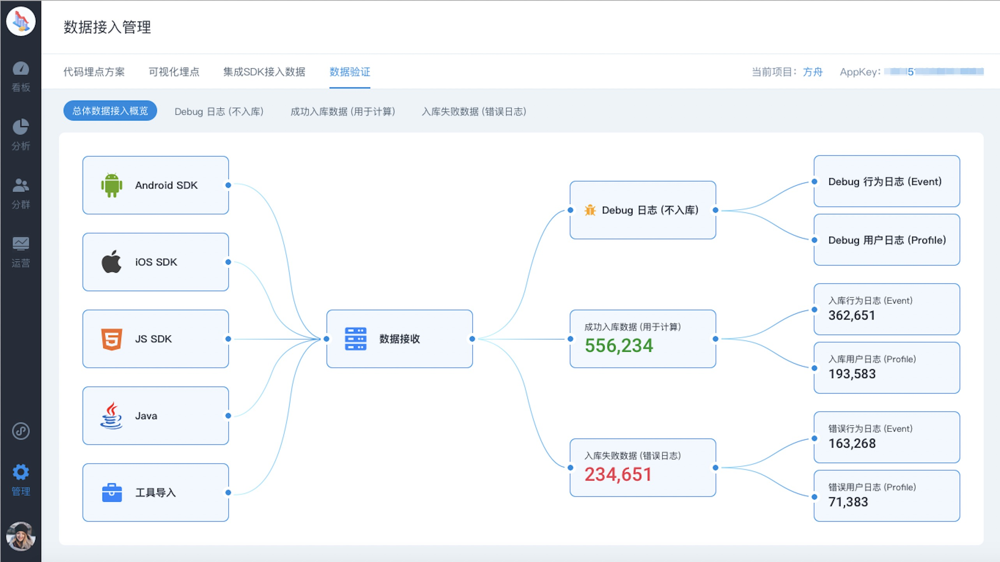

# 数据验证

在易观方舟中大家会关注的数据主要有两类：

* 指标级数据，包括细分维度拆解（通过计算得出）
* 最细粒度的行为数据（通过 SDK 或者工具接入）

对不同粒度的数据进行验证时，需要采用不同的方法。

## 指标级数据验证

通常在以下情况下会遇到易观方舟中计算的指标结果与期望的不一致：

1. 与原使用第三方分析平台的指标对比
2. 与自建数据仓库基础上计算的指标对比
3. 与实际点击操作后手动计算的结果对比
4. 与日常数据表现对比

不同的情况需要从不同的角度着手排查

### 1 与原使用第三方分析平台的指标对比

与原使用的第三方分析平台对比出现差异时，主要有以下三方面的影响因素：

* 指标统计的口径
* 用于计算的数据池
* 接入的数据源

#### Step ****1 对比指标统计口径

先确定不同的数据平台上相同名称的指标背后的计算口径是否相同。

比如同样是活跃用户，在有些平台上是以活跃的设备为准， 有些平台上以活跃的帐号为准，有些平台又是以发生了某个行为为准。


常见百度统计和易观方舟的用户数会有差异，因为两个平台的数据模型的不同，方舟以用户为中心，而百度统计以设备为中心。


#### **Step 2 对比用于计算的数据池**

对于部分平台，比如GA，可以建立数据视图，自定义用于计算的数据范围；比如其他很多产品都可以在指定分群或者条件下查看某些指标，这时候如果跟方舟里的全量数据对比时自然会有差异，所以一定要选择相同的条件。

#### **Step 3 细分维度对比**

如果口径和条件都一致时，可以细分某些维度，对比是所有维度值都有差异，还是只有部分差异


特别细分平台、应用版本、页面URL等等这样可能涉及到数据来源的维度


#### **Step 4 对比接入的数据源**

通常对比以下项：

* 是否接入了相同的平台，比如是否都是多端接入
* 是否接入了相同的版本，比如是否某个平台是在某个版本之后才开始接入的
* 是否接入时间相同，比如对于新增访问用户指标来说，和接入平台的数据有很大关系
* 是否使用了相同的数据上报方式，比如对于前端上报的方式可能会有不同比例的数据遗漏

### **2** 与后台/自建数据仓库基础上计算的指标对比

思路同[与原使用第三方分析平台的指标对比](./#1-yu-yuan-shi-yong-di-san-fang-fen-xi-ping-tai-de-zhi-biao-dui-bi)


另外相比有些第三方平台只提供统计级的数据，自有平台通常追溯到最原始的明细数据来对比。

比如发现方舟中上报的注册成功的用户数和后台实际注册成功的用户数不同时，即可以在方舟中按照用户ID/手机号/邮箱等用户标识细分导出明细，与后台进行对比差异，找出可能的问题。


### 3 与实际点击操作后手动计算的结果对比

这种情况只涉及到方舟系统的数据接收、处理和计算，通过以下几个方面排查即可：

#### Step 1 确定查看指标时，选择的日期、平台等条件与对比的实际操作在同一区间

我们遇到有的用户行为发生在今天，但是在界面上选择的日期不包含今天，天然会导致结果不一致。

> **注意：**过去 n 日，不包含今日；近 n 日，包括今日。

#### Step 2 确认当前项目数据流、接收服务状态等是否正常

当数据流关闭时，会导致不能实时计算最新的数据，接收服务异常时，可能会导致数据不能正常上报


该情况发生的概率极小，当异常时平台管理员通常会收到告警邮件；在项目中也可以查看状态。


#### Step 3 数据接入是否正确，详见[《数据接入验证》](./#zui-xi-li-du-ji-shu-ju-jie-ru-yan-zheng)


除了接入本身正确之外，也需要注意要计算的事件/属性是否在埋点方案中。只有在埋点方案中，上报正确的事件/属性才可以用于后续分析。


### 4 与日常数据表现对比

这样情况同样只涉及到方舟系统内的数据，若发现跟日常数据相比异常高或底，可以通过以下三个方面确定是服务异常还是正常的

#### Step 1 确定当前项目数据流、服务状态等是否正常

#### Step 2 最近是否有进行运营活动引流或者产品功能改动

#### Step 3 通过进一步细分维度，定位可能的原因


部分指标异常是因为项目中包含了内部流量，内部流量和外部流量行为上通常会有较大差异，尤其是测试人员的强度测试会造成某些页面或者某个事件上报大量数据， 影响衡量真正用户的指标。

目前可以通过以下方式过滤：

1. 在分析模型中创建指标时，添加事件条件，选择 IP 不等于内部 IP；
2. 创建 [虚拟事件](../../features/project-manegement/meta-data/merged-events.md)，增加过滤条件 IP 不等于内部 IP。

若测试集中在少数人员上，也可以选择用户ID、邮箱或者手机号来过滤具体的用户。

更便捷的 IP 过滤/数据视图我们正在开发中。



若想通过和第三方平台对比来确定方舟数据的准确性，建议通过对比比如注册用户数这样口径明确的指标来进行。



若您正在使用易观方舟的商业版，遇到了指标差异的情况，请联系您的专属客户服务专家，全程协助您定位排查问题。


## 最细粒度级数据接入验证

数据指标及进一步应用的可靠性追根溯源都依赖于接入的最细粒度的原始数据的完整性、准确性和及时性。方舟中数据从产生到查询会经过以下几个环节，当任何一个环节出错时，都有可能会导致出现偏差。

1. **SDK/工具导入**（接收地址错误、基础格式错误会导致无法上报）
2. **数据接收**（AppKey 错误的数据会被过滤掉、接收服务异常可能也导致丢数）
3. **Debug 日志过滤**（Debug=1的数据不会入库参与计算，仅用于单条验证接入的正确性）
4. **数据入库校验**（格式错误、设置不在埋点方案中的事件/属性不入库时，数据都会进入错误队列；只有成功入库的数据可参与计算）
5. **可查询的事件/属性过滤**（成功入库的数据可以通过元事件管理中的状态来进一步控制是否在查询时可见；注：只有在埋点方案中且已经回数的事件/属性才在元事件管理中可见）
6. **查询展示**

所以在需求方上传了埋点方案后，工程师在接入过程最少按照以下步骤进行：

1. 集成 SDK，在客户端或者设置 Debug=1在产品中初步查看单条事件/属性上报是否正确
2. 当没有明显错误后，关闭Debug模式，通过埋点方案中的状态查看埋点上报的完整性和正确性
3. 查看错误队列，是否有大量异常数据

### **1 客户端埋点验证**

很多的数据问题都是因为客户端埋点不正确导致，所以在集成SDK时一定要检查以下项：

1. 是否使用了最新版本的 SDK（有些功能所需数据只有新版本SDK才会上报）
2. AppKey是否填写正确
3. 上报地址是否配置正确，尤其是小程序数据的上报
4. 数据是否能正常发送
5. 是否选择了合适的SDK，比如有些事件更适合在服务端上报

更多检查项：

1. 是否覆盖了所有涉及到的页面
2. 是否覆盖了位于不同页面的相同事件
3. 是否因为页面跳转导致有些事件不能完全上报

在客户端查看数据验证集成正确性的具体方法详见以下文档：



### **2 Debug 数据验证**

在客户端直接查看上报数据时，可能格式不够友好，可以在 Debug 数据验证 功能中直接查看，具体的使用方法详见以下文档：



### **3 数据入库验证**

经过 Debug 单条验证后，关闭 Debug 模式

1. 在埋点方案中，检查埋点的完整性和正确性
2. 在错误数据日志中，检查

具体使用方法详见以下文档：




以上内容没有解答我的问题？[点击我进入方舟论坛去反馈](https://www.analysysdata.com/forum/index) 🚀


