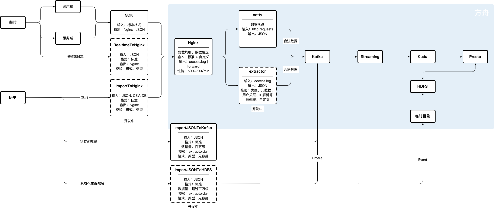

# 数据导入

如果你有历史数据需要导入，可以根据数据量级选择合适的导入工具。如下图：

| 数据状态 | 数据量范围 | 首选工具 |
| :--- | :--- | :--- |
| 历史 | 数百万 | ImportJSONToKafka |
| 历史 | 数十万 | API |
| 实时 | - | SDK, API |

## ImportJSONToKafka

通过命令行导入可以在易观方舟的服务器上进行，可以避免网络传输造成的不稳定甚至数据丢失，可以最大限度确保效率和准确。缺点是需要自己按格式提前准备好所需的文件。

| 语言 | 场景 | 数据量范围 | 输入 | 输出 |
| :--- | :--- | :--- | :--- | :--- |
| Java | 可以登录方舟服务器 | 数百万 | 方舟标准数据格式的 Json 文件 | 方舟 Kafka |



## API

通过 Restful API 可以将历史数据通过网络上报到易观方舟 Nginx 收数程序，这种方式适用于不方便登录方舟服务器，并且数据量不大的情况。

| 语言 | 场景 | 数据量范围 | 输入 | 输出 |
| :--- | :--- | :--- | :--- | :--- |
| 不限 | 无法登录方舟服务器 | - | 方舟标准数据格式 | 方舟 Nginx |



