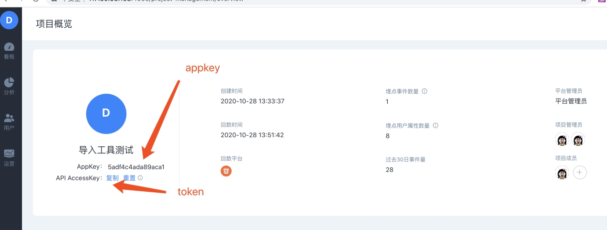

# 标准json文件导入

## 1.介绍说明

* 多线程的方式，读取指定目录下json格式文件，导入程序分别将事件数据导入方舟事件数据Topic、用户数据导入方舟用户数据Topic；
* 实现断点续转功能，保证数据不丢失，不重复。已经读取完成的文件不会重复读取；
* 工具只支持每行一个json字符串导入，暂不支持json数组导入；


1、单个文件同时只能由一个线程读取。

2、文档中都是以集群版为例切换机器或连接服务，如果是**单机版**，将对应的ark2/ark3**改为ark1**即可。

3、json文件格式需符合方舟事件和用户数据模型，详见：[数据格式](../../prepare/data-type.md#shang-bao-shu-ju-de-ge-shi)。

4、导入文件需要以event\_和profile\_开头。



**建议**：为保证正式项目数据导入的准确性，在数据导入正式项目前，建议先创建一个测试项目，将测试数据导入测试项目中，测试数据导入完成并且数据校验无误后，即可删除测试项目，将正式数据导入到正式项目，进而保证了数据导入的准确性。


## 2.运行环境

导入工具需要在JAVA环境中运行，单机版和集群版都可以使用。


1、导入工具需要在方舟部署服务器/可访问方舟服务器上的机器上使用；

2、为了避免网络异常、数据传输速度等造成数据导入慢等问题，**建议**数据导入工作在**方舟**部署的任一**服务器**上**使用**。


## 3.使用方法

标准json导入工具通过父命令+子命令的形式直接启动。

### 3.1.参数说明

| 参数名称 | 参数示例 | 参数说明 | 是否必传 |
| :--- | :--- | :--- | :--- |
| -k | 31abd9593e9983ec | 项目appKey | 是 |
| -T | 4113c9cad1c301113783f433e254888c | 项目token，对应的API AccessKey | 是 |
| -d | /data/tmp | 需要导入的json文件的导入目录 | 是 |
| --help/-h | 无 | 显示json导入帮助文档 | 否 |

### 3.2.项目token位置获取

token获取路径：

```text
右下角管理->项目概览
```



### 3.3.示例展示

将/data/tmp/20201203/test123321/文件夹下的事件数据导入项目test123321。

```text
arksh std-import -k test123321 -T 444ed5f2f167c1364494100fe8cf616e -d /data/tmp/20201203/test123321/
```

