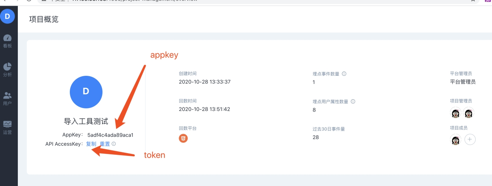

# 用户数据导出

## 1. 介绍说明

导出方舟项目用户数据到本地。

## 2. 运行环境

导出工具需要在JAVA环境中运行，单机版和集群版都可以使用。


1、导出工具需要在方舟部署服务器/可访问方舟服务器上的机器上使用；

2、为了避免网络异常、数据传输速度等造成数据导出慢等问题，**建议**数据导出工作在**方舟**部署的任一**服务器上**使用。


## 3. 使用方法

用户数据导出工具通过父命令+子命令的形式直接启动。

### 3.1.参数说明

| 参数名称 | 参数示例 | 参数说明 | 是否必传 |
| :--- | :--- | :--- | :--- |
| -k | 31abd9593e9983ec | 项目appKey | 是 |
| -T | 4113c9cad1c301113783f3 | 项目token，对应的API AccessKey | 是 |
| -b | false | 导出数据的开始时间，格式为yyyyMMdd | 是 |
| --help/-h | 无 | 显示用户事件导出帮助文档 | 否 |

### 3.2.项目token位置获取

token获取路径：

```text
右下角管理->项目概览
```



## 3.3.示例展示

导出项目test123321的全部用户数据。

```text
arksh profile-export -k test123321 -T 444ed5f2f167c1364494100fe8cf616e
```

