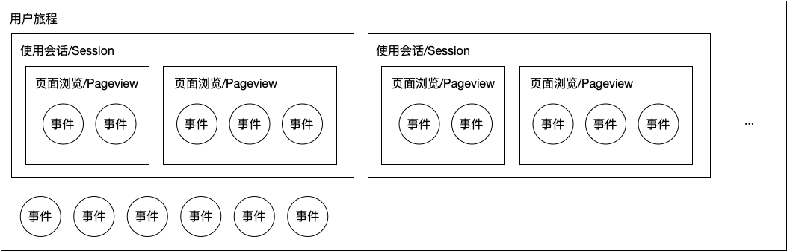

# 数据模型

用户行为其实就是何人，何时，何地，通过何种方式，发生了何种行为。易观方舟通过**事件模型**来描述用户的一系列行为。事件模型包含了 **事件（Event）**和 **用户（Profile）**两个实体，数据上报时，也会通过 Event 和 Profile 两大类事件接口来上报。

* 事件 \(Event\) 接口上报事件信息，用以记录用户在何时通过何种方式发生了何种行为；
* 用户 \(Profile\) 接口上报用户信息，用以记录用户属性相关的信息，来描述用户的属性或某时刻的状态；

## 1. 与 Session/Pageview Vs. Event

大家可能对 Session/Pageview 模型比较熟悉，因为它们是网页分析时代的基本概念。用户从访问一个网站的第一个页面开始，就会开始记录为一个 Session，当这个人在网站上超过30分钟没有任何操作时，这个 Session 就结束了。这个Session就会被视作一个会话，也就是用户在网站上通过一系列连续的行为完成了一次使用。过程中，每访问一个页面，都会记录一个 Pageview。这两个特殊的行为发生时也会产生一些相关的属性，比如 Pageview 中可以默认获取到当前页面的标题、上一页的地址、访问IP、浏览器以及操作系统的各种信息等，这些信息让我们基本上可以完成所有网站相关的分析。

在 App 时代，技术、分析方法和用户的使用方法都发生了很大变化。首先 App 上并没有网站默认的 Session 概念，Pageview 也因为 App 的制作方法五花八门而难以获取正确，而 App 的分析和运营时会更依赖于用户在 App 上的更细粒度的操作，例如：购买了什么、支付了多少、参与了什么活动等等。仅仅是 Pageview 这样页面访问的行为就无法满足需要了。这就要求我们推出一套更具有普适性的模型来应对这种改变，同时还要对网站分析有所兼容。

从上图中不难看出，用户旅程包含了用户完整生命周期的所有行为，使用会话则是一些部分连续行为的集合，页面浏览是一个特殊的事件，它逻辑上比普通事件要高一级，但实际上它也只是一个叫 Pageview 的事件而已。通常来说事件都会发生在页面的之内，但也有一些事件并不是发生在客户端内的，比如服务端上报的，或者 App 位于后台时的事件，那这类事件就不会在逻辑上被算作 Session 及 Pageview 的下级行为了。

通过这样的设计，我们就可以很容易对不同级别的行为进行分析了。例如：

| 行为 | 指标类型 |
| :--- | :--- |
| 用户旅程 | 人均时长，总时长，人均次数，总次数…… |
| 使用会话 | 人均时长，总时长，人均次数，总次数，周期内次数，时长分布，次数分布…… |
| 页面浏览 | 人均时长，总时长，人均次数，总次数，周期内次数，时长分布，次数分布…… |
| 普通事件 | 总次数，周期内次数，次数分布…… |

## 2. 事件 \(Event\)

Event 核心是何人 \(xwho\) 、何时 \(xwhen\) 、何地 \(xwhere\) 、通过何种方式 \(xcontext\) 、发生了何种行为 \(xwhat\) 五要素。

**xwho**

xwho 描述事件发生的实体，即何人。在用户未登录的情况下，xwho 会是一个方舟匿名生成的 ID，在已登录的情况下的，xwho 应及时被客户自己业务系统的ID所改写（详细可以查看[《如何准确识别用户》](user-identify.md)）。同时，在方舟系统中，每个 xwho 会对应有一个方舟唯一ID（distinct\_id），计算时会使用这个ID。

**xwhen**

xwhen 描述事件发生的时间，即何时。记录的是事件发生的实际时间戳，客户端的时间，精确到毫秒。

**xwhere**

where 描述事件发生的地点，即何地。方舟会默认采集 IP，后端数据处理引擎会自动根据 IP 解析为国家、省份、城市三个字段；当然，如果不想通过这种方式获得地理位置，也可以在集成 SDK 时手动设置 `$country`、`$province`、`$city`的值，当手动设置后，将会覆盖根据 IP 自动解析的值。

当然除了国家、省份、城市这种最基础的地理位置标识方法之外，用户可以自定义更多地理位置的属性，比如城市等级、商圈等。

**xwhat**

xwhat 描述事件本身，即发生了何事，可以是打开 APP、 点击某个按钮、打开某个页面等在APP/Web等应用上的任何操作，也可以是线下某次刷卡、电话投诉等等，每个动作在都可以定义为一个事件， 通过埋点的方式上报，在方舟的数据接口中，使用 xwhat 来存储事件。

当然，为了更精准的描述用户发生的行为，会引入事件属性，例如：

* 对于 “用户注册” 事件，可能通过属性：注册来源、注册用户名等来描述；
* 对于“ 搜索” 事件，可能通过属性：搜索关键词、搜索位置等来描述；
* 对于 “提交订单” 事件，可能通过属性：商品名称、商品金额、配送方式、优惠方式等来描述。

在方舟的数据接口中，使用 xcontext 来存储事件属性。

**xcontext**

xcontext 描述事件的属性，即以何种方式发生。xcontext 是一个比较广泛的概念，除了包括 xwhat 中提到的事件本身的属性之外，还会包括用户使用的设备信息（设备品牌、型号等）、使用时的网络状态、使用的应用版本、来源渠道等等，在事件发生时，一起作为上下文信息上报。

方舟系统预置了一些属性在每个事件中上报，使常用的分析维度无须再手动上报，详见[《预置事件和属性》](default-data.md)。

## 3. 用户 \(profile\)

用户是发生事件的实体，方舟通过方舟ID（distinct\_id） 来标识用户，并与对应事件关联。方舟支持通过一系列的 profile 接口来上报更新用户属性，即 profile 信息。

通常是在用户注册、完善个人信息、修改资料等的情况下，调用相应的 profile 接口来上报。

#### 属性何时上报到事件属性，何时上报到用户属性？

和某个行为的结果相关的属性应该上报到事件属性；而会对用户有长期影响并且很可能不可修改及逆转的则应该上报到用户属性。

