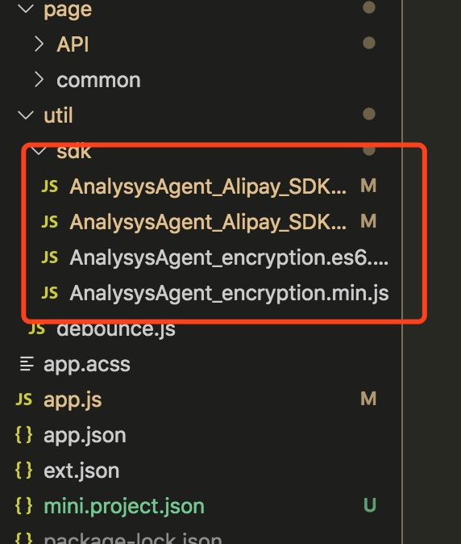

# 支付宝小程序标准版

支付宝小程序SDK集成前请先下载SDK


SDK Releases包下载：  
Github地址\(推荐\)：[https://github.com/analysys/ans-Alipay-sdk/releases](https://github.com/analysys/ans-Alipay-sdk/releases/)  
Gitee地址：[https://gitee.com/Analysys/ans-Alipay-sdk/releases](https://gitee.com/Analysys/ans-Alipay-sdk/releases)  
Releases中含有更新说明请您阅读，接口使用请参考本文档。


| js文件 | 功能描述 | 是否必须 |
| :---: | :---: | :---: |
| AnalysysAgent\_Alipay\_SDK.min.js | 基础模块SDK | 二选一 |
| AnalysysAgent\_Alipay\_SDK.es6.min.js | 基础模块ES6语法SDK | 二选一 |
| AnalysysAgent\_encryption.min.js | 加密模块 | 非必须 |
| AnalysysAgent\_encryption.es6.min.js | 加密模块ES6语法配合标准版ES6版本使用 | 非必须 |


注意：请您根据自身业务需求来引用相关的SDK。


### 快速集成

如果您是第一次使用易观方舟产品，可以通过阅读本文快速了解此产品

#### 1. 集成 SDK

在app.js文件的顶部引入SDK。

#### 2. 设置初始化接口

通过初始化代码的配置参数配置您的AppKey。

#### 3. 设置上传地址

通过初始化代码的配置参数uploadURL设置您上传数据的地址。

#### 4. 配置上传地址域名

登录支付宝开放平台，将上传地址域名配置到服务器域名白名单中

#### 5. 设置需要采集的页面或事件

通过手动埋点，设置需要采集的页面或事件。

#### 6. 打开 Debug 模式查看日志

通过设置Ddebug模式，开/关 log 查看日志。

通过以上步骤您即可验证SDK是否已经集成成功。更多接口说明请您查看API文档。

## 集成配置

### 集成 SDK

将 AnalysysAgent\_Alipay\_SDK.min.js 文件放到小程序的目录下



支付宝小程序只容许https默认端口（443）进行数据访问，请注意方舟上报端口为默认端口。否则数据将无法上报。

在小程序的 app.js 文件中的第一行加入以下代码:

```javascript
let AnalysysAgent = require("./build/AnalysysAgent_Alipay_SDK.min.js")
//设置您的APPKEY
AnalysysAgent.appkey = "/*设置为实际APPKEY*/" 
```

如需要加密模块

```javascript
let AnalysysEncryption = require("./build/AnalysysAgent_encryption.min.js")
AnalysysAgent.encrypt = AnalysysEncryption
```

对于使用 es6 版本的

```javascript
import AnalysysAgent from  './build/AnalysysAgent_Alipay_SDK.es6.min.js';
import AnalysysEncryption from  './build/AnalysysAgent_encryption.es6.min.js';
AnalysysAgent.encrypt = AnalysysEncryption;
```

基础版本开启全埋点接入方式:

目前全埋点支持taro、uniapp、mpvue

Chameleon暂不支持



```javascript
//标准版本开启全埋点接入方式示例：
// app.js
import AnalysysAgent from  './build/AnalysysAgent_Alipay_SDK.es6.min.js';
//设置您的APPKEY
AnalysysAgent.appkey = "/*设置为实际APPKEY*/" 
//设置您的上报地址
AnalysysAgent.uploadURL = '/*设置为方舟项目上报的地址*/'
AnalysysAgent.autoTrack = true
```



```
//框架（taro）开启全埋点接入方式示例：
//app.jsx
let AnalysysAgent = require("./build/AnalysysAgent_Alipay_SDK.min.js")
AnalysysAgent.appkey = "/*设置为实际APPKEY*/" //APPKEY
AnalysysAgent.uploadURL = '/*设置为方舟项目上报的地址*/'
AnalysysAgent.autoTrack = true
```



```
//框架（uniapp）开启全埋点接入方式示例：
// main.js
import AnalysysAgent from './sdk/AnalysysAgent_Alipay_SDK.es6.min.js';
import Vue from 'vue'
import App from './App'

AnalysysAgent.appkey = "/*设置为实际APPKEY*/" //APPKEY
AnalysysAgent.uploadURL = '/*设置为方舟项目上报的地址*/'
AnalysysAgent.autoTrack = true//框架（uniapp）开启全埋点接入方式示例：
```



```
//main.js
import AnalysysAgent from './sdk/AnalysysAgent_Alipay_SDK.es6.min.js';
import Vue from 'vue'
import App from './App'

AnalysysAgent.appkey = "/*设置为实际APPKEY*/" //APPKEY
AnalysysAgent.uploadURL = '/*设置为方舟项目上报的地址*/'
AnalysysAgent.autoTrack = true//框架（mpvue）开启全埋点接入方式示例：
```



在各个 Page 内通过以下代码获取 AnalysysAgent\_Alipay\_SDK 全局函数:

```javascript
let AnalysysAgent = my.AnalysysAgent;
```

在组件Component 内通过以下代码获取 AnalysysAgent\_Alipay\_SDK 全局函数:

```javascript
let AnalysysAgent = my.AnalysysAgent;
```

注：组件绑定的 behaviors.js 内的方法，全埋点不支持，不能上报。


请注意:  
1.将 appkey 的值填入您具体的项目 appkey  
2.目录为您所引入支付宝小程序 SDK 的具体目录


### 配置参数

* _appkey_\(必须\) 在网站获取的 AppKey
* _debugMode_ 设置调试模式：0 - 关闭调试模式\(默认\)；1 - 开启调试模式，数据不入库；2 - 开启调试模式，数据入库
* _uploadURL_\(必须\) 自定义上传地址
* _auto_ 设置打开/关闭自动采集页面：false - 关闭自动采集；true - 开启自动采集\(默认\)
* _autoProfile_ 设置是否追踪新用户的首次属性：false - 不追踪新用户的首次属性；true - 追踪新用户的首次属性\(默认\)
* _encryptType_ 设置是否对上传数据加密：0 - 对上传数据不加密\(默认\)；1 - 对上传数据进行AES 128位ECB加密；2 对上传数据进行AES 128位CBC加密
* _autoShare_ 设置是否自动采集分享按钮点击事件：false\(默认\) - 关闭自动采集分享按钮点击事件；true - 开启自动采集分享按钮点击事件
* _allowTimeCheck_ 设置是否开启时间校准：false\(默认\) - 关闭时间校准；true - 开启时间校准
* _maxDiffTimeInterval_ 设置最大时间校准分为：30s\(默认\) ，当设置的时间差值小于他，将不开启校准。否则将会进行时间校准。假如设置成为负值，将默认为 30s。
* _autoTrack_ 设置是否开启全埋点,false - 不开启全埋点\(默认\)；true - 开启全埋点；开启全埋点将会上报所有绑定（支持tab、longtab、longpress）事件,并上报$user\_click事件,设置data-content为采集的`$element_content`、data-type为采集的`$element_type`、data-name为采集的`$element_name`、id为采集的`$element_id`。若不设置Data属性会导致无法采集预制属性。不支持系统方法包括生命周期事件的上报，如果要采集tabbar切换，务必在注册Page的时候注册OnTabItemTap方法，否则采集不到。

**appkey**

appkey 在网站获取的 AppKey。

* value 在网站获取的 AppKey。类型:String。取值长度 1 - 255字符。

```javascript
// 设置key，77a52s552c892bn442v721为样例数据，请根据实际情况替换相应内容
AnalysysAgent.appkey = "77a52s552c892bn442v721"
```

#### debugMode

debugMode 调试模式为接入 支付宝 SDK后进行数据调试的主要手段。可实时验证 支付宝 SDK数据监测的正确与否。

* 0 关闭调试模式\(默认\)。类型：Number。
* 1 开启调试模式，数据不入库。类型：Number。
* 2 开启调试模式，数据入库。类型：Number。

```javascript
//开启调试模式且数据不入库
AnalysysAgent.debugMode = 1
//开启调试模式且数据入库
AnalysysAgent.debugMode = 2
//关闭调试模式
AnalysysAgent.debugMode = 0
//或删除该段代码
```

或删除 debugMode 参数。

#### uploadURL

uploadURL 为自定义上传地址，参数设置后，所有事件信息将上传到该地址。

* value 类型：String。数据上传地址，格式为 scheme://host + :port\(不包含/后的内容\)。scheme 必须以 http:// 或 https:// 开头，host 只支持域名和 IP，取值长度 1 - 255字符，port 端口号必须携带

```javascript
//设置自定义上传地址为 scheme://host + :port
AnalysysAgent.uploadURL = "/*设置为实际地址*/"
```

**auto**

auto 为设置打开/关闭自动采集页面的参数。可根据自身需要进行更改。

* true 开启自动采集页面打开事件\(默认\)。类型：Boolean。
* false 关闭自动采集页面打开事件。类型：Boolean。

```javascript
//关闭自动采集页面打开事件，关闭后可使用小程序 SDK的API中的手动发送页面打开数据方法，来发送页面打开状态的数据。
AnalysysAgent.auto = false
//开启自动采集页面打开事件。
AnalysysAgent.auto = true //或删除该行代码。
```

#### autoProfile

autoProfile 为设置是否追踪新用户的首次属性。可根据自身需要进行更改。

* true 追踪新用户的首次属性\(默认\)。类型：Boolean。
* false 不追踪新用户的首次属性。类型：Boolean。

```javascript
//不追踪新用户的首次属性，新用户首次打开网站不上传新用户的首次属性。
AnalysysAgent.autoProfile = false
//追踪新用户的首次属性，新用户首次打开网站上传新用户的首次属性。
AnalysysAgent.autoProfile = true//或删除该行代码。
```

#### encryptType

encryptType 为设置数据上传时的加密方式,目前只支持 AES 加密，如不设置此参数，数据上传不加密。。可根据自身需要进行更改。

* 0 对上传数据不加密\(默认\)。类型：Number。
* 1 对上传数据进行AES 128位ECB加密。类型：Number。
* 2 对上传数据进行AES 128位CBC加密。类型：Number。

```javascript
//对上传数据不加密。
AnalysysAgent.encryptType = 0//或删除该行代码。
//对上传数据进行AES 128位ECB加密
AnalysysAgent.encryptType = 1
// 对上传数据进行AES 128位CBC加密
AnalysysAgent.encryptType = 2
```

**autoShare**

autoShare 为设置是否自动采集分享按钮点击事件，只采集分享按钮的点击事件，不区分分享是否成功。可根据自身需要进行更改。

* false 关闭自动采集分享按钮点击事件\(默认\)。类型：Boolean。
* true 自动采集分享按钮点击事件。类型：Boolean。

```javascript
//关闭自动采集分享按钮点击事件。
AnalysysAgent.autoShare = false//或删除该行代码。
//自动采集分享按钮点击事件。
AnalysysAgent.autoShare = true
```

#### allowTimeCheck

allowTimeCheck 为设置是否开启时间校准，开启时间校准在debug 1或者 2 的情况下会有相关提示。

* false 关闭时间校准\(默认\)。类型：Boolean。
* true 开启时间校准。类型：Boolean。

```javascript
//关闭时间校准。
AnalysysAgent.allowTimeCheck = false//或删除该行代码。
//开启时间校准。
AnalysysAgent.allowTimeCheck = true
```

#### maxDiffTimeInterval

maxDiffTimeInterval 为设置不校准时间的最大时间差值。当客户端时间和服务端时间相差在此区间内，将不进行时间校准，否则将进行时间校准。

* value：类型 Number 。默认值 30。单位：秒。

```javascript
//设置最大允许时间
AnalysysAgent.maxDiffTimeInterval = 20 
//当服务端和客户端的时间差超过 20s 将进行时间校准 
```

**autoTrack**

开启全埋点后会自动采集可触控元素\(支持：tab类型、longtab类型、longpress类型\),并上报`$user_click`事件。

 自动采集时需要设置Data类型属性，若不设置Data属性会导致无法采集预制属性，设置data-content为采集的`$element_content`、data-type为采集的`$element_type`、data-name为采集的`$element_name`、id为采集的`$element_id`。 

不支持系统方法包括生命周期事件的上报，如果要采集tabbar切换，务必在注册Page的时候注册OnTabItemTap方法，否则采集不到。

* false 关闭全埋点采集\(默认\)。类型：Boolean。
* true 开启全埋点采集。类型：Boolean。

```javascript
//关闭全埋点
AnalysysAgent.autoTrack = false //或删除该行代码。
//开启全埋点
AnalysysAgent.autoTrack = true
```

### 域名配置

登录支付宝开放平台，设置&gt;开发设置&gt;服务器域名白名单，加入您所配置的 `https` 域名：`example.com`



支付宝小程序只容许https默认端口（443）进行数据访问，请注意方舟上报端口为默认端口。否则数据将无法上报。


## 基础模块介绍

### 统计页面接口介绍

页面跟踪，SDK 默认设置跟踪所有页面，支持自定义页面信息。接口如下：

```javascript
AnalysysAgent.pageView(pageName);
AnalysysAgent.pageView(pageName, properties);
```

* pageName：页面标识，为字符串，取值长度 1 - 255字符
* properties：页面信息，为K-V键值对。最多包含100条，且`key`是以字母开头的字符串，**必须由**字母、数字、下划线组成，字母不区分大小写，**不支持**乱码、中文、空格等，长度范围1-99字符；`value`支持类型：String/Number/Boolean/JSON/内部元素为String的Array，若为字符串，长度范围1-255字符。

示例：

```javascript
// 正在开展某个活动，需要统计活动页面；
AnalysysAgent.pageView("活动页");

......

// 访问手机活动页面，活动页面内容为优惠出售iPhone手机，手机价格为5000元
var properties ={
    "commodityName": "iPhone",
    "commodityPrice": 8000
}

AnalysysAgent.pageView("商品页", properties);
```

### 统计事件接口

用户行为追踪，可以设置自定义属性。接口如下：

```javascript
AnalysysAgent.track(eventName, eventInfo)
```

* eventName：自定义事件ID标识，以字母开头的字符串，**必须由**字母、数字、下划线组成，$ 开头为预置事件/属性，**不支持**乱码、中文、空格等，长度范围1-99字符。
* eventInfo：自定义属性，K-V键值对，用于对事件的描述。最多包含100条，且`key`是以字母开头的字符串，**必须由**字母、数字、下划线组成，字母不区分大小写，**不支持**乱码、中文、空格等，长度范围1-99字符；`value`支持类型：String/Number/Boolean/JSON/内部元素为String的Array，若为字符串，长度范围1-255字符。

示例：

```javascript
// 添加事件
AnalysysAgent.track("back");

......

// 用户购买手机
var eventInfo = {
    "type":"Phone",
    "name":"Apple iPhone8",
    "money":4000,
    "count":1
}
AnalysysAgent.track("buy", eventInfo);
```

### 采集分享按钮点击事件

采集分享按钮点击事件，只采集分享按钮的点击事件，不区分分享是否成功。方法返回对象（toShareProperties）。接口如下：

```javascript
AnalysysAgent.share(toShareProperties,trackProperties);
```

* toShareProperties\(可选\)，分享属性，包括自定义title等，不写将全部用默认。 
* trackProperties\(可选\)，分享事件自定义属性。K-V键值对，最多包含 100条，且`key`是以字母开头的字符串，**必须由** 字母、数字、下划线组成，字母不区分大小写，**不支持** 乱码、中文、空格等，长度范围1-99字符；value支持类型：String/Number/Boolean/JSON/内部元素为String的Array，若为字符串，长度范围1-255字符。

示例：

```javascript
// 自动采集，设置autoShare为true和分享属性即可
Page({
    onShareAppMessage:function(){
        let toShareProperties = {
          title: '自定义转发标题',
          path: '/page/user?id=123'
        }
        return toShareProperties
    }
})
// 手动采集，需要关闭自动，设置autoShare 为 false
Page({
    onShareAppMessage:function(){
        let toShareProperties = {
          title: '自定义转发标题',
          path: '/page/user?id=123'
        }
        let trackProperties = {
            custom:'weChat'
        }
        return AnalysysAgent.share(toShareProperties,trackProperties);
    }
})
```

### 注册页面事件通用属性

注册应用中所有页面通用属性，设置后当次小程序启动后所有页面都拥有该属性，直至该小程序关闭。接口如下：

```javascript
AnalysysAgent.appProperty(properties)
```

* properties：页面信息，K-V键值对。最多包含100条，且`key`是以字母开头的字符串，**必须由**字母、数字、下划线组成，字母不区分大小写，**不支持**乱码、中文、空格等，长度范围1-99字符；`value`支持类型：String/Number/Boolean/JSON/内部元素为String的Array，若为字符串，长度范围1-255字符。

示例：

```javascript
// 设置被分享页面所属分享群ID
var properties ={
    openGId:'123456789'
}

AnalysysAgent.appProperty(properties);
```

### 匿名ID与用户关联

用户关联的主要作用是打通用户登录前后的行为，以及多屏登录后的行为。做过用户关联的用户在登录前后的行为在方舟系统里面会被认为是一个用户。方舟系统目前支持 一台设备只能绑定一个用户 ID，一个用户 ID 只能绑定一台设备。设备和用户 ID 绑定后，就无法再和其他用户或者设备进行绑定。例如一个用户的设备 ID 是 ABC 用户的登录 ID 是 123，绑定成功后会对应同一个 ID，这样在统计或者分析时会被认为是一个用户。**在用户注册成功或者登录成功后客户端需要调用 alias 接口**，建议埋点时观看下 [方舟 SDK 接入视频](https://ark.analysys.cn/video-list.html) 接口描述如下：

用户 id 关联接口。将需要绑定的用户ID 和匿名ID进行关联，计算时会认为是一个用户的行为。接口如下：

```javascript
AnalysysAgent.alias(aliasId);
```

* aliasId：需要关联的用户ID。 取值长度 1 - 255字符,支持类型：String

示例：

```javascript
// 登陆账号时调用，只设置当前登陆账号即可和之前行为打通
AnalysysAgent.alias("sanbo");
```

### 匿名ID设置

唯一匿名ID标识设置，接口如下：

```javascript
AnalysysAgent.identify(distinctId);
```

* distinctId：自定义设备身份标识，取值长度 1 - 255字符,支持类型：String

示例:

```text
// 设置匿名ID为`fangke009901`,注意此方法需要在初始化之后优先调用
AnalysysAgent.identify("fangke009901");
```

### 匿名ID获取

获取用户通过identify接口设置或自动生成的id，优先级如下： 用户设置的id &gt; 代码自动生成的id

接口如下：

```javascript
AnalysysAgent.getDistinctId();
```

示例:

```javascript
// 获取匿名id
var distinctId = AnalysysAgent.getDistinctId();
```

### 用户属性设置

> 用户属性是一个标准的 K-V 结构，K 和 V 均有相应的约束条件，如不符合则丢弃该次操作。

约束条件如下：

> **属性名称**

```text
以字母开头的字符串，必须由字母、数字、下划线组成，字母不区分大小写，$ 开头为预置事件/属性，不支持乱码、中文、空格等，长度范围1-99字符。
```

> **属性值**

```text
支持部分类型：String/Number/Boolean/内部元素为String的Array；若为字符串，则取值长度 1 - 255字符；若为 Array 或 JSON，则最多包含 100条，且 key 约束条件与属性名称一致，value 取值长度 1 - 255字符
```

#### 设置用户固有属性

设置用户的固有属性，只在首次设置时有效的属性。 如：应用的激活时间、首次登录时间等。如果被设置的用户属性已存在，则这条记录会被忽略而不会覆盖已有数据，如果属性不存在则会自动创建。接口如下：

```javascript
AnalysysAgent.profileSetOnce(propertyName, propertyValue);

AnalysysAgent.profileSetOnce(property);
```

* propertyName ：属性名称，约束见属性名称
* propertyValue ：属性值，约束见属性值
* property ： 属性列表，约束见属性名称，属性值

示例：

```javascript
// 设置用户激活时间
AnalysysAgent.profileSetOnce("activationTime", "2018-06-18 18:18:18.188");

// 设置用户性别和出生时间
var setOnceProfile = {
    "birth": "2018-06-18 18:18:18.188",
    "sex": "male"
}
AnalysysAgent.profileSetOnce(setOnceProfile);
```

#### 设置用户属性

给用户设置单个或多个属性，如果之前不存在，则新建，否则覆盖。接口如下：

```javascript
//设置单个用户属性
AnalysysAgent.profileSet(propertyName, propertyValue);
//设置多个用户属性
AnalysysAgent.profileSet(property);
```

* propertyName ：属性名称，约束见属性名称
* propertyValue ：属性值，约束见属性值
* property ： 属性列表，约束见属性名称，属性值

示例：

```javascript
//设置用户的邮箱地址为yonghu@163.com
AnalysysAgent.profileSet("Email", "yonghu@163.com");

......

// 设置用户的邮箱和微信
var property = {
    "Email" : "yonghu@163.com",
    "WeChatID" : "weixinhao"
}
AnalysysAgent.profileSet(property);
```

#### 设置用户属性相对变化值

设置用户属性的相对变化值\(相对增加，减少\)，只能对数值型属性进行操作，如果这个 Profile之前不存在，则初始值为0。接口如下：

```javascript
AnalysysAgent.profileIncrement(propertyName, propertyNumber)

AnalysysAgent.profileIncrement(property);
```

* propertyName ：属性名称，约束见属性名称
* propertyValue ：属性值，约束见属性值
* property ： 属性列表，约束见属性名称，属性值

示例：

```javascript
//用户增加一岁
AnalysysAgent.profileIncrement("age",1);

......

//用户玩某个游戏时间增加一年，游戏等级增加2
var incrementProfile = {
    "gameAge":1,
    "gameRating":2
}
AnalysysAgent.profileIncrement(incrementProfile);
```

#### 增加列表类型的属性

用户列表属性增加元素。接口如下：

```javascript
//增加单个属性
AnalysysAgent.profileAppend(propertyName, propertyValue);
//增加多个属性
AnalysysAgent.profileAppend(propertyValue);
//增加多个属性
AnalysysAgent.profileAppend(propertyName, propertyValue);
```

* propertyName ：属性名称，约束见属性名称
* propertyValue ：属性值，约束见属性值

示例：

```javascript
// 增加用户爱好 music
AnalysysAgent.profileAppend("hobby", "Music");

// 增加多个用户属性
var map = {
    "hobby": "PlayBasketball",
    "sports": "Run"
};
AnalysysAgent.profileAppend(mContext, map);

//增加多个用户爱好
var list = ["PlayBasketball", "music"];
AnalysysAgent.profileAppend("hobby", list);
```

#### 删除设置的属性值

删除已设置的用户属性值。接口如下：

```javascript
AnalysysAgent.profileUnset(propertyName);
AnalysysAgent.profileDelete();
```

* propertyName ：属性名称，约束见属性名称

示例：

```javascript
//  删除当前用户单个属性值
AnalysysAgent.profileUnset( "age");

//  删除当前用户所有属性值
AnalysysAgent.profileDelete();
```

### 通用属性

> 通用属性是每次上传事件信息都会带有的属性，通用属性是一个标准的 K-V 结构，K 和 V 均有相应的约束条件，如不符合则丢弃该次操作。

约束条件如下:

> **属性名称**

```text
以字母开头的字符串，必须由字母、数字、下划线组成，字母不区分大小写，$ 开头为预置事件/属性，不支持乱码、中文、空格等，长度范围1-99字符。
```

> **属性值**

```text
支持部分类型：String/Number/boolean/内部元素为String的Array；若为字符串，则取值长度 1 - 255字符；若为 Array 或 JSON,则最多包含 100条，且 key 约束条件与属性名称一致，value 取值长度 1 - 255字符
```

#### 注册通用属性

某一个体，在固定范围内，持续拥有的属性，每次数据上传都会携带。接口如下:

```javascript
AnalysysAgent.registerSuperProperty(superPropertyName , superPropertyValue );

AnalysysAgent.registerSuperProperties(superProperty);
```

* superPropertyName：属性名称，约束见属性名称
* superPropertyValue：属性值，约束见属性值
* superProperty：属性列表，约束见属性名称，属性值

示例：

```javascript
// 在某视频平台，购买一年会员，该年内只需设置一次即可
AnalysysAgent.registerSuperProperty("member","VIP");

......

// 小明在20岁的时候，购买了一年腾讯会员
var property = {
    "platform":"TX",
    "age":"20",
    "member":"VIP",
    "user":"xiaoming"
}
AnalysysAgent.registerSuperProperties(property);
```

#### 删除通用属性

根据属性名称，删除已设置过的通用属性。接口如下：

```javascript
//删除单个通用属性
AnalysysAgent.unRegisterSuperProperty(superPropertyName);
//清除所有通用属性
AnalysysAgent.clearSuperProperties();
```

* superPropertyName：属性名称，约束见属性名称

示例：

```javascript
// 删除已经设置的用户年龄属性
AnalysysAgent.unRegisterSuperProperty("age");

......

// 清除所有已经设置的通用属性
AnalysysAgent.clearSuperProperties();
```

#### 获取通用属性

查询获取通用属性。接口如下：

```javascript
// 获取单个通用属性
AnalysysAgent.getSuperProperty(superPropertyName);
// 获取所有的通用属性
AnalysysAgent.getSuperProperties();
```

* superPropertyName：属性名称，约束见属性名称

示例：

```javascript
// 查看已经设置的"member"的通用属性
AnalysysAgent.getSuperProperty("member");

......

// 查看所有已经设置的通用属性
AnalysysAgent.getSuperProperties();
```

### 获取预置属性

获取预置属性。接口如下：

```javascript
AnalysysAgent.getPresetProperties();
```

示例：获取预置属性

```javascript
// 获取预置属性
var presetProperties = AnalysysAgent.getPresetProperties();

console.log('预置属性:', presetProperties)
```

### 清除本地设置

清除本地现有的设置（包括 id 和通用属性）重新开始统计。接口如下：

```javascript
AnalysysAgent.reset();
```

示例：清除本地现有的设置，包括id和通用属性

```javascript
// 删除设置的id和通用属性
AnalysysAgent.reset();
```

