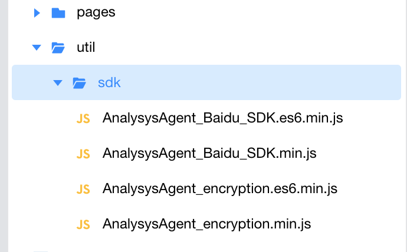

# 百度小程序 SDK

百度小程序 SDK 集成前请先下载 SDK


[Releases包下载及更新说明](https://github.com/analysys/ans-Baidu-sdk/releases)


| js文件 | 功能描述 | 是否必须 |
| :---: | :---: | :---: |
| AnalysysAgent\_\_Baidu\_SDK.min.js | 基础模块SDK | 二选一 |
| AnalysysAgent\_\_Baidu\_SDK.es6.min.js | 基础模块ES6语法SDK | 二选一 |
| AnalysysAgent\_encryption.min.js | 加密模块 | 非必须 |
| AnalysysAgent\_encryption.es6.min.js | 加密模块ES6语法配合标准版ES6版本使用 | 非必须 |


注意：请您根据自身业务需求来引用相关的SDK。


### 快速集成

如果您是第一次使用易观方舟产品，可以通过阅读本文快速了解此产品

#### 1. 集成 SDK

在app.js文件的顶部引入SDK。

#### 2. 设置初始化接口

通过初始化代码的配置参数配置您的AppKey。

#### 3. 设置上传地址

通过初始化代码的配置参数uploadURL设置您上传数据的地址。

#### 4. 配置上传地址域名

登录百度开放平台，将上传地址域名配置到服务器域名白名单中

#### 5. 设置需要采集的页面或事件

通过手动埋点，设置需要采集的页面或事件。

#### 6. 打开 Debug 模式查看日志

通过设置Ddebug模式，开/关 log 查看日志。

#### 7.调用小程序启动事件

在app.js文件中调用小程序启动事件

```javascript
import AnalysysAgent from './util/sdk/AnalysysAgent_Baidu_SDK.es6.min.js'
AnalysysAgent.appkey = "/*设置为实际APPKEY*/" //APPKEY
AnalysysAgent.uploadURL = "/*设置为实际地址*/"

App({
    onShow (options) {
        AnalysysAgent.appStart(options);
    }
})

```

#### 8.调用小程序启动事件

在每一个页面的入口js文件中调用小程序统计页面事件

```javascript
let AnalysysAgent = my.AnalysysAgent
Page({
    onShow () {
        AnalysysAgent.pageView('首页');//页面名称可自定义。
    }
})
```

通过以上步骤您即可验证SDK是否已经集成成功。更多接口说明请您查看API文档。

## 集成配置

### 集成 SDK

将 AnalysysAgent\_Baidu\_SDK.custom.min.js 文件放到小程序的目录下



百度小程序只容许https默认端口（443）进行数据访问，请注意方舟上报端口为默认端口。负责数据将无法上报。

在小程序的 app.js 文件中的第一行加入以下代码:

```javascript
import AnalysysAgent from './util/sdk/AnalysysAgent_Baidu_SDK.es6.min.js'
AnalysysAgent.appkey = "/*设置为实际APPKEY*/" //APPKEY
```

如需要加密模块

```javascript
import AnalysysEncryption from './util/sdk/AnalysysAgent_encryption.es6.min.js'
AnalysysAgent.encrypt = AnalysysEncryption
```

es6版本不是每个框架都能用，不能使用es6的请如下使用

```javascript
let AnalysysAgent = require('./util/sdk/AnalysysAgent_Baidu_SDK.min.js')
AnalysysAgent.appkey = "/*设置为实际APPKEY*/" //APPKEY
```

如需要加密模块

```javascript
let AnalysysEncryption = require('./util/sdk/AnalysysAgent_encryption.min.js')
AnalysysAgent.encrypt = AnalysysEncryption
```

在各个 Page 内通过以下代码获取 AnalysysAgent\_Baidu\_SDK 全局函数:

```javascript
let AnalysysAgent = swan.AnalysysAgent;
```


请注意:  
1.将 appkey 的值填入您具体的项目 appkey  
2.目录为您所引入百度小程序 SDK 的具体目录


### 配置参数

* _appkey_\(必须\) 在网站获取的 AppKey
* _debugMode_ 设置调试模式：0 - 关闭调试模式\(默认\)；1 - 开启调试模式，数据不入库；2 - 开启调试模式，数据入库
* _uploadURL_\(必须\) 自定义上传地址
* _autoProfile_ 设置是否追踪新用户的首次属性：false - 不追踪新用户的首次属性；true - 追踪新用户的首次属性\(默认\)
* _encryptType_ 设置是否对上传数据加密：0 - 对上传数据不加密\(默认\)；1 - 对上传数据进行AES 128位ECB加密；2 对上传数据进行AES 128位CBC加密
* _allowTimeCheck_ 设置是否开启时间校准：false\(默认\) - 关闭时间校准；true - 开启时间校准
* _maxDiffTimeInterval_ 设置最大时间校准分为：30s\(默认\) ，当设置的时间差值小于他，将不开启校准。否则将会进行时间校准。假如设置成为负值，将默认为 30s。

**appkey**

appkey 在网站获取的 AppKey。

* value 在网站获取的 AppKey。类型:String。取值长度 1 - 255字符。

```javascript
// 设置key，77a52s552c892bn442v721为样例数据，请根据实际情况替换相应内容
AnalysysAgent.appkey = "77a52s552c892bn442v721"
```

#### debugMode

debugMode 调试模式为接入SDK后进行数据调试的主要手段。可实时验证SDK数据监测的正确与否。

* 0 关闭调试模式\(默认\)。类型：Number。
* 1 开启调试模式，数据不入库。类型：Number。
* 2 开启调试模式，数据入库。类型：Number。

```javascript
//开启调试模式且数据不入库
AnalysysAgent.debugMode = 1
//开启调试模式且数据入库
AnalysysAgent.debugMode = 2
//关闭调试模式
AnalysysAgent.debugMode = 0
//或删除该段代码
```

或删除 debugMode 参数。

#### uploadURL

uploadURL 为自定义上传地址，参数设置后，所有事件信息将上传到该地址。

* value 类型：String。数据上传地址，格式为 scheme://host + :port\(不包含/后的内容\)。scheme 必须以 http:// 或 https:// 开头，host 只支持域名和 IP，取值长度 1 - 255字符，port 端口号必须携带

```javascript
//设置自定义上传地址为 scheme://host + :port
AnalysysAgent.uploadURL = "/*设置为实际地址*/"
```

#### autoProfile

autoProfile 为设置是否追踪新用户的首次属性。可根据自身需要进行更改。

* true 追踪新用户的首次属性\(默认\)。类型：Boolean。
* false 不追踪新用户的首次属性。类型：Boolean。

```javascript
//不追踪新用户的首次属性，新用户首次打开网站不上传新用户的首次属性。
AnalysysAgent.autoProfile = false
//追踪新用户的首次属性，新用户首次打开网站上传新用户的首次属性。
AnalysysAgent.autoProfile = true//或删除该行代码。
```

#### encryptType

encryptType 为设置数据上传时的加密方式,目前只支持 AES 加密，如不设置此参数，数据上传不加密。。可根据自身需要进行更改。

* 0 对上传数据不加密\(默认\)。类型：Number。
* 1 对上传数据进行AES 128位ECB加密。类型：Number。
* 2 对上传数据进行AES 128位CBC加密。类型：Number。

```javascript
//对上传数据不加密。
AnalysysAgent.encryptType = 0//或删除该行代码。
//对上传数据进行AES 128位ECB加密
AnalysysAgent.encryptType = 1
// 对上传数据进行AES 128位CBC加密
AnalysysAgent.encryptType = 2
```

#### allowTimeCheck

allowTimeCheck 为设置是否开启时间校准，开启时间校准在debug 1或者 2 的情况下会有相关提示。

* false 关闭时间校准\(默认\)。类型：Boolean。
* true 开启时间校准。类型：Boolean。

```javascript
//关闭时间校准。
AnalysysAgent.allowTimeCheck = false//或删除该行代码。
//开启时间校准。
AnalysysAgent.allowTimeCheck = true
```

#### maxDiffTimeInterval

maxDiffTimeInterval 为设置不校准时间的最大时间差值。当客户端时间和服务端时间相差在此区间内，将不进行时间校准，否则将进行时间校准。

* value：类型 Number 。默认值 30。单位：秒。

```javascript
//设置最大允许时间
AnalysysAgent.maxDiffTimeInterval = 20 
//当服务端和客户端的时间差超过 20s 将进行时间校准 
```

### 域名配置

登录百度开放平台，设置&gt;开发设置&gt;服务器域名白名单，加入您所配置的 `https` 域名：`example.com`



百度小程序只容许https默认端口（443）进行数据访问，请注意方舟上报端口为默认端口。否则数据将无法上报。


## 基础模块介绍

### 启动事件接口

启动事件 appStart\(options\),百度SDK启动事件需要手动调用，而且只能调用一次。

```javascript
//标准示例
AnalysysAgent.appStart(options);

//taro框架示例:
componentDidShow () {
    const params = this.$router.params
    AnalysysAgent.appStart(params);
}
//mpvue框架示例:
onShow (options) {
    AnalysysAgent.appStart(options);
}

```

options：options为小程序 onShow\(options\)获取到的参数，包括query、url等,不同框架，不同方式获取，请开发者根据使用的框架获取。

### 统计页面接口介绍

页面跟踪，百度SDK需要手动设置跟踪所有页面，支持自定义页面信息。接口如下：

```javascript
AnalysysAgent.pageView(pageName);
AnalysysAgent.pageView(pageName, properties);
```

* pageName：页面标识，为字符串，取值长度 1 - 255字符
* properties：页面信息，properties 最多包含 100条，且 key 以字母或 `$` 开头，包含字母、数字、下划线和 `$`，字母不区分大小写，`$` 开头为预置事件/属性，不支持乱码和中文，取值长度 1 - 99字符，value 支持类型：String/Number/boolean/内部元素为String的Array，若为字符串，取值长度 1 - 255字符

示例：

```javascript
// 正在开展某个活动，需要统计活动页面；
AnalysysAgent.pageView("活动页");

......

// 访问手机活动页面，活动页面内容为优惠出售iPhone手机，手机价格为5000元
var properties ={
    "commodityName": "iPhone",
    "commodityPrice": 8000
}

AnalysysAgent.pageView("商品页", properties);
```

### 统计事件接口

用户行为追踪，可以设置自定义属性。接口如下：

```javascript
AnalysysAgent.track(eventName, eventInfo)
```

* eventName：事件ID，以字母或 `$` 开头，包含字母、数字、下划线和 `$`，字母不区分大小写，`$` 开头为预置事件/属性，不支持乱码和中文，取值长度 1 - 99字符
* eventInfo：自定义属性，用于对事件描述。eventInfo 最多包含 100条，且 key 以字母或 `$` 开头，包含字母、数字、下划线和 `$`，字母不区分大小写，`$` 开头为预置事件/属性，不支持乱码和中文，取值长度 1 - 99字符，value 支持类型：String/Number/boolean/内部元素为String的Array，若为字符串，取值长度 1 - 255字符

示例：

```javascript
// 添加事件
AnalysysAgent.track("back");

......

// 用户购买手机
var eventInfo = {
    "type":"Phone",
    "name":"Apple iPhone8",
    "money":4000,
    "count":1
}
AnalysysAgent.track("buy", eventInfo);
```

### 注册页面事件通用属性

注册应用中所有页面通用属性，设置后当次小程序启动后所有页面都拥有该属性，直至该小程序关闭。接口如下：

```javascript
AnalysysAgent.appProperty(properties)
```

* properties：页面信息，properties 最多包含 100条，且 key 以字母或 `$` 开头，包含字母、数字、下划线和 `$`，字母不区分大小写，`$` 开头为预置事件/属性，不支持乱码和中文，取值长度 1 - 99字符，value 支持类型：String/Number/boolean/内部元素为String的Array，若为字符串，取值长度 1 - 255字符

示例：

```javascript
// 设置被分享页面所属分享群ID
var properties ={
    openGId:'123456789'
}

AnalysysAgent.appProperty(properties);
```

### 匿名ID与用户关联

用户 id 关联接口。将需要绑定的用户ID 和匿名ID进行关联，计算时会认为是一个用户的行为。接口如下：

```javascript
AnalysysAgent.alias(aliasId);
```

* aliasId：需要关联的用户ID。 取值长度 1 - 255字符,支持类型：String

示例：

```javascript
// 登陆账号时调用，只设置当前登陆账号即可和之前行为打通
AnalysysAgent.alias("sanbo");
```

### 匿名ID设置

唯一匿名ID标识设置，接口如下：

```javascript
AnalysysAgent.identify(distinctId);
```

* distinctId：唯一身份标识，取值长度 1 - 255字符,支持类型：String

示例:

```text
// 设置匿名ID为`fangke009901`,注意此方法需要在初始化之后优先调用
AnalysysAgent.identify("fangke009901");
```

### 匿名ID获取

获取用户通过identify接口设置或自动生成的id，优先级如下： 用户设置的id &gt; 代码自动生成的id

接口如下：

```javascript
AnalysysAgent.getDistinctId();
```

示例:

```javascript
// 获取匿名id
var distinctId = AnalysysAgent.getDistinctId();
```

### 用户属性设置

> 用户属性是一个标准的 K-V 结构，K 和 V 均有相应的约束条件，如不符合则丢弃该次操作。

约束条件如下：

> **属性名称**

```text
以字母或`$`开头，包含字母、数字、下划线和`$`，字母不区分大小写，`$`开头为预置事件/属性，则取值长度 1 - 99 字符，不支持乱码和中文
```

> **属性值**

```text
支持部分类型：String/Number/Boolean/内部元素为String的Array；若为字符串，则取值长度 1 - 255字符；若为 Array 或 JSON，则最多包含 100条，且 key 约束条件与属性名称一致，value 取值长度 1 - 255字符
```

#### 设置用户固有属性

设置用户的固有属性，只在首次设置时有效的属性。 如：应用的激活时间、首次登录时间等。如果被设置的用户属性已存在，则这条记录会被忽略而不会覆盖已有数据，如果属性不存在则会自动创建。接口如下：

```javascript
AnalysysAgent.profileSetOnce(propertyName, propertyValue);

AnalysysAgent.profileSetOnce(property);
```

* propertyName ：属性名称，约束见属性名称
* propertyValue ：属性值，约束见属性值
* property ： 属性列表，约束见属性名称，属性值

示例：

```javascript
// 设置用户激活时间
AnalysysAgent.profileSetOnce("activationTime",1521280551929);

// 设置用户性别和出生时间
var setOnceProfile = {
    "birth": 548798705000,
    "sex": "male"
}
AnalysysAgent.profileSetOnce(setOnceProfile);
```

#### 设置用户属性

给用户设置单个或多个属性，如果之前不存在，则新建，否则覆盖。接口如下：

```javascript
//设置单个用户属性
AnalysysAgent.profileSet(propertyName, propertyValue);
//设置多个用户属性
AnalysysAgent.profileSet(property);
```

* propertyName ：属性名称，约束见属性名称
* propertyValue ：属性值，约束见属性值
* property ： 属性列表，约束见属性名称，属性值

示例：

```javascript
//设置用户的邮箱地址为yonghu@163.com
AnalysysAgent.profileSet("Email", "yonghu@163.com");

......

// 设置用户的邮箱和微信
var property = {
    "Email" : "yonghu@163.com",
    "WeChatID" : "weixinhao"
}
AnalysysAgent.profileSet(property);
```

#### 设置用户属性相对变化值

设置用户属性的相对变化值\(相对增加，减少\)，只能对数值型属性进行操作，如果这个 Profile之前不存在，则初始值为0。接口如下：

```javascript
AnalysysAgent.profileIncrement(propertyName, propertyNumber)

AnalysysAgent.profileIncrement(property);
```

* propertyName ：属性名称，约束见属性名称
* propertyValue ：属性值，约束见属性值
* property ： 属性列表，约束见属性名称，属性值

示例：

```javascript
//用户增加一岁
AnalysysAgent.profileIncrement("age",1);

......

//用户玩某个游戏时间增加一年，游戏等级增加2
var incrementProfile = {
    "gameAge":1,
    "gameRating":2
}
AnalysysAgent.profileIncrement(incrementProfile);
```

#### 增加列表类型的属性

用户列表属性增加元素。接口如下：

```javascript
//增加单个属性
AnalysysAgent.profileAppend(propertyName, propertyValue);
//增加多个属性
AnalysysAgent.profileAppend(propertyValue);
//增加多个属性
AnalysysAgent.profileAppend(propertyName, propertyValue);
```

* propertyName ：属性名称，约束见属性名称
* propertyValue ：属性值，约束见属性值

示例：

```javascript
// 增加用户爱好 music
AnalysysAgent.profileAppend("hobby", "Music");

// 增加多个用户属性
var map = {
    "hobby": "PlayBasketball",
    "sports": "Run"
};
AnalysysAgent.profileAppend(mContext, map);

//增加多个用户爱好
var list = ["PlayBasketball", "music"];
AnalysysAgent.profileAppend("hobby", list);
```

#### 删除设置的属性值

删除已设置的用户属性值。接口如下：

```javascript
AnalysysAgent.profileUnset(propertyName);
AnalysysAgent.profileDelete();
```

* propertyName ：属性名称，约束见属性名称

示例：

```javascript
//  删除当前用户单个属性值
AnalysysAgent.profileUnset( "age");

//  删除当前用户所有属性值
AnalysysAgent.profileDelete();
```

### 通用属性

> 通用属性是每次上传事件信息都会带有的属性，通用属性是一个标准的 K-V 结构，K 和 V 均有相应的约束条件，如不符合则丢弃该次操作。

约束条件如下:

> **属性名称**

```text
以字母或`$`开头，包含字母、数字、下划线和`$`，字母不区分大小写，`$`开头为预置事件/属性，则取值长度 1 - 99 字符，不支持乱码和中文
```

> **属性值**

```text
支持部分类型：String/Number/boolean/内部元素为String的Array；若为字符串，则取值长度 1 - 255字符；若为 Array 或 JSON,则最多包含 100条，且 key 约束条件与属性名称一致，value 取值长度 1 - 255字符
```

#### 注册通用属性

某一个体，在固定范围内，持续拥有的属性，每次数据上传都会携带。接口如下:

```javascript
AnalysysAgent.registerSuperProperty(superPropertyName , superPropertyValue );

AnalysysAgent.registerSuperProperties(superProperty);
```

* superPropertyName：属性名称，约束见属性名称
* superPropertyValue：属性值，约束见属性值
* superProperty：属性列表，约束见属性名称，属性值

示例：

```javascript
// 在某视频平台，购买一年会员，该年内只需设置一次即可
AnalysysAgent.registerSuperProperty("member","VIP");

......

// 小明在20岁的时候，购买了一年腾讯会员
var property = {
    "platform":"TX",
    "age":"20",
    "member":"VIP",
    "user":"xiaoming"
}
AnalysysAgent.registerSuperProperties(property);
```

#### 删除通用属性

根据属性名称，删除已设置过的通用属性。接口如下：

```javascript
//删除单个通用属性
AnalysysAgent.unRegisterSuperProperty(superPropertyName);
//清除所有通用属性
AnalysysAgent.clearSuperProperties();
```

* superPropertyName：属性名称，约束见属性名称

示例：

```javascript
// 删除已经设置的用户年龄属性
AnalysysAgent.unRegisterSuperProperty("age");

......

// 清除所有已经设置的通用属性
AnalysysAgent.clearSuperProperties();
```

#### 获取通用属性

查询获取通用属性。接口如下：

```javascript
// 获取单个通用属性
AnalysysAgent.getSuperProperty(superPropertyName);
// 获取所有的通用属性
AnalysysAgent.getSuperProperties();
```

* superPropertyName：属性名称，约束见属性名称

示例：

```javascript
// 查看已经设置的"member"的通用属性
AnalysysAgent.getSuperProperty("member");

......

// 查看所有已经设置的通用属性
AnalysysAgent.getSuperProperties();
```

### 获取预置属性

获取预置属性。接口如下：

```javascript
AnalysysAgent.getPresetProperties();
```

示例：获取预置属性

```javascript
// 获取预置属性
var presetProperties = AnalysysAgent.getPresetProperties();

console.log('预置属性:', presetProperties)
```

### 清除本地设置

清除本地现有的设置（包括 id 和通用属性）重新开始统计。接口如下：

```javascript
AnalysysAgent.reset();
```

示例：清除本地现有的设置，包括id和通用属性

```javascript
// 删除设置的id和通用属性
AnalysysAgent.reset();
```

