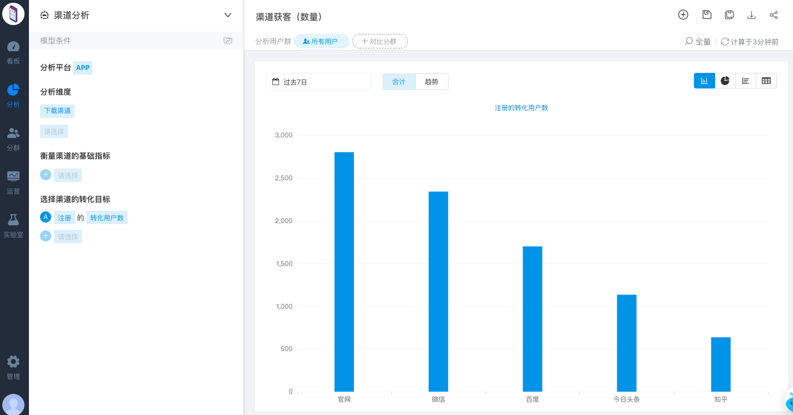
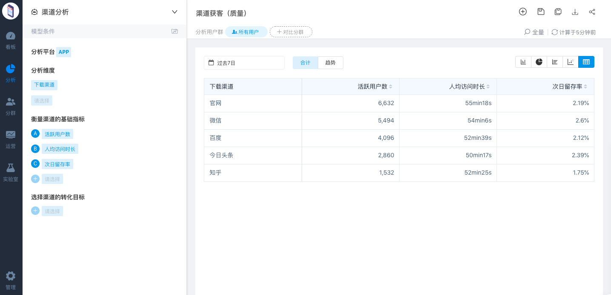
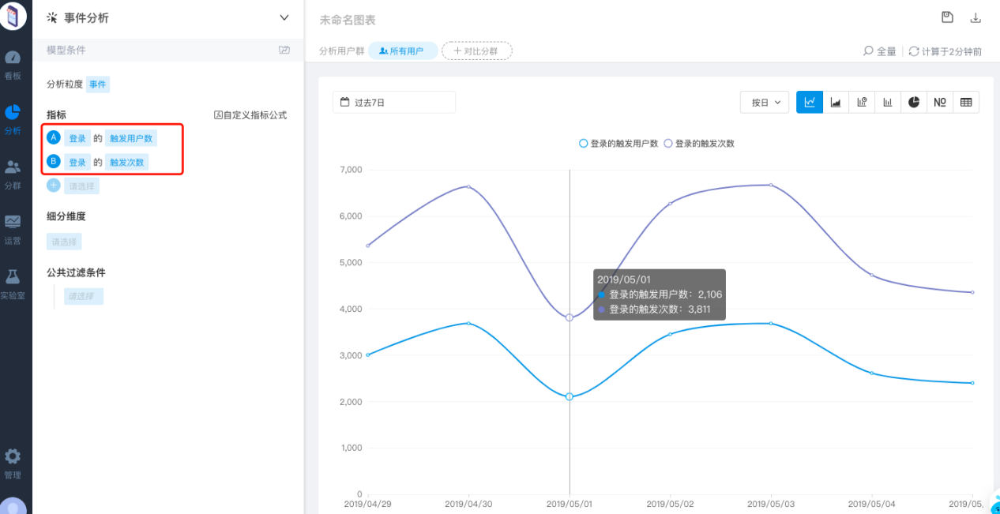
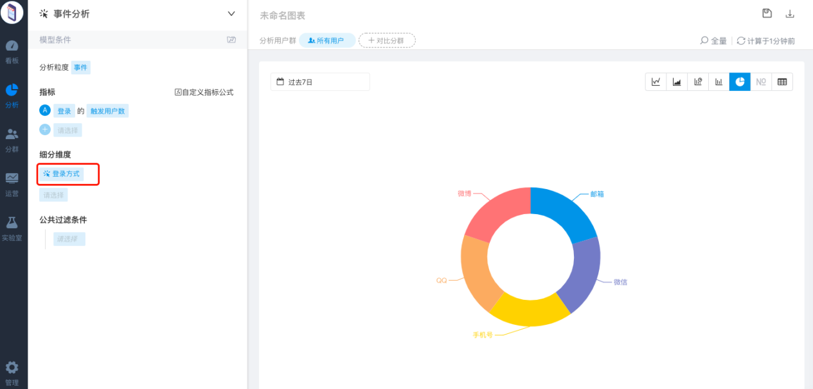
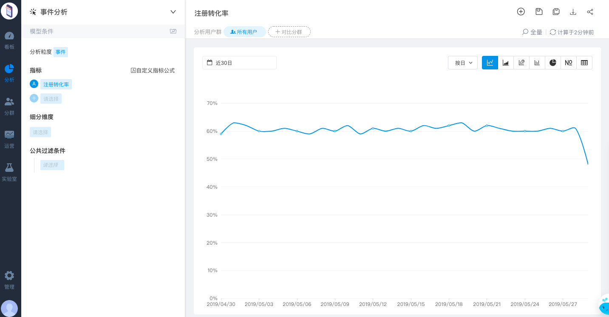
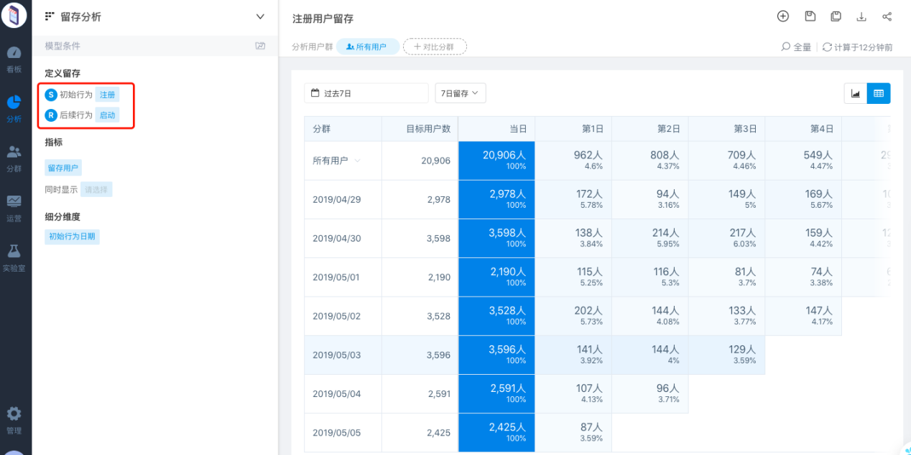
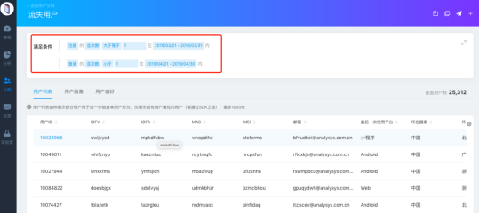
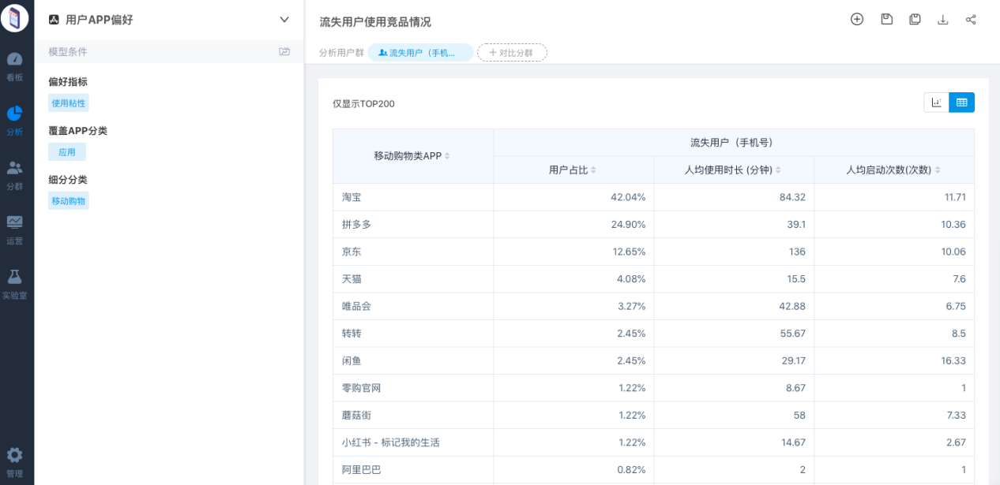
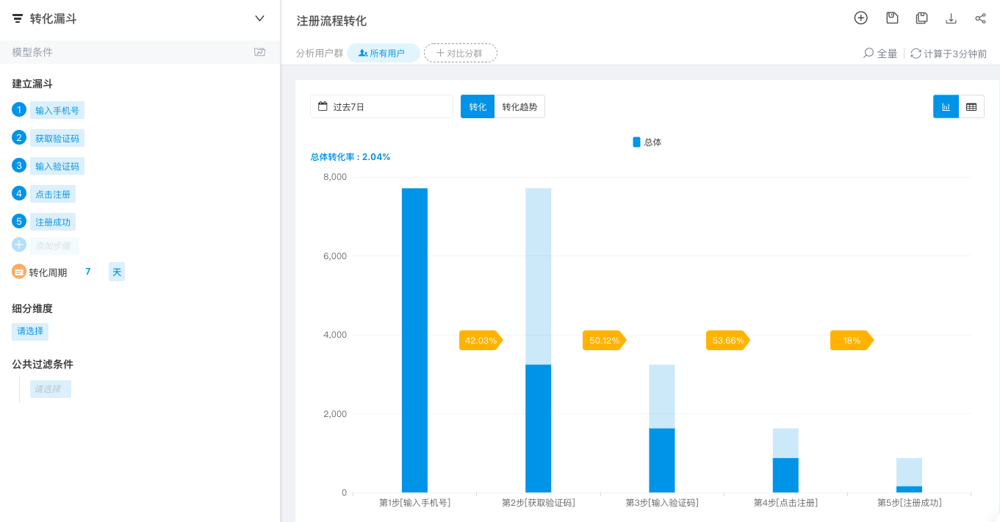
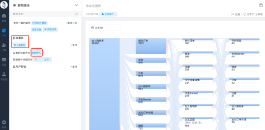

# 附：数据分析思路

对于一款App来讲，可以从用户的新增、活跃、转化、留存/流失等指标，了解产品的整体运营状况；从业务人员的角度出发，市场渠道人员比较关注渠道的获客质量，运营人员比较关注用户在产品内的行为信息，从而对用户分群，进行针对性的运营，产品人员则关注产品功能的使用情况以及核心流程的转化情况。

以有帐号体系产品的注册为核心流程为例，如何通过方舟的功能实现所有业务人员的数据需求？

一般产品的注册流程为：

输入手机号→点击获取验证码→输入验证码→点击注册→注册/登录

## **渠道市场人员**

### [渠道分析](../features/analytics/channel/)

#### 了解各渠道的获客能力，进而结合投放成本计算 ROI 

1.分渠道统计注册用户数--评估渠道获客数量

2.分渠道统计活跃用户数、人均使用时长和留存--评估渠道获客质量

## **运营人员**

### [事件分析](../features/analytics/event.md)

#### 主要分析用户在应用上的行为数据

1.了解活跃用户的情况，可以从登录事件的触发用户数和触发次数进行分析

2.可以从细分维度分析，根据登录方式的占比，评估用户偏好，优化登录通道

3.注册转化率趋势：了解产品的注册转化率是否符合行业标准，同时通过趋势，发现异常

### [留存分析](../features/analytics/retention.md)

#### 是一种衡量用户健康度/参与度的方法，深入了解用户的留存和流失状况

1.注册用户留存，根据产品的性质选择留存周期，若用户的留存率较低，可以通过运营活动提高用户粘性，比如签到

### [用户分群](../features/segmentation/)

#### 用户分群即将用户标签化，把具有相同特征 / 行为的用户进行聚类，是精细化运营的基础。

1.流失用户：3月份注册但4月份都没有登录的用户

2.了解流失用户使用竞品情况

若用户使用竞品的时间和次数比较频繁，可以了解竞品近期的运营策略，结合竞品情况，采取相应的运营措施对用户进行召回

3.流失用户召回

制定好运营活动之后，可以通过[短信推送](../features/operation/sms.md)/[消息通知](../features/operation/pushmessage.md)等方式，触达用户，让用户及时了解运营活动，从而促进用户转化

## **产品人员**

### [转化漏斗](../features/analytics/funnel.md)

分析核心业务流程的转化和流失情况，不仅找出产品潜在问题的位置，还可以定位每个环节流失用户，进而定向营销促转化

1.注册流程的转化

若产品的注册转化率较低，可以通过注册流程的转化发现用户流失的重要节点，发现问题：

1.短信通道下发短信是否收到验证码

2.产品是否出现bug导致用户注册失败

### [智能路径](../features/analytics/pathfinder.md)

用户在应用中使用的行为轨迹，可以验证产品的设计思路，指导产品迭代优化。

## [可视化看板](../features/dashboard.md)

为了方便日常数据的监控，可以把日常需要查看的指标，做成可视化看板


以上内容没有解答我的问题？[点击我来反馈](https://support.qq.com/products/118522/) 🚀


