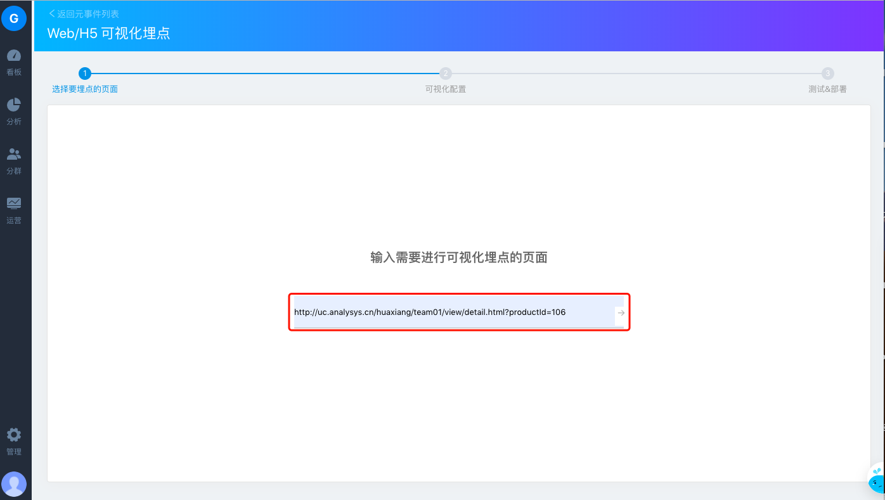
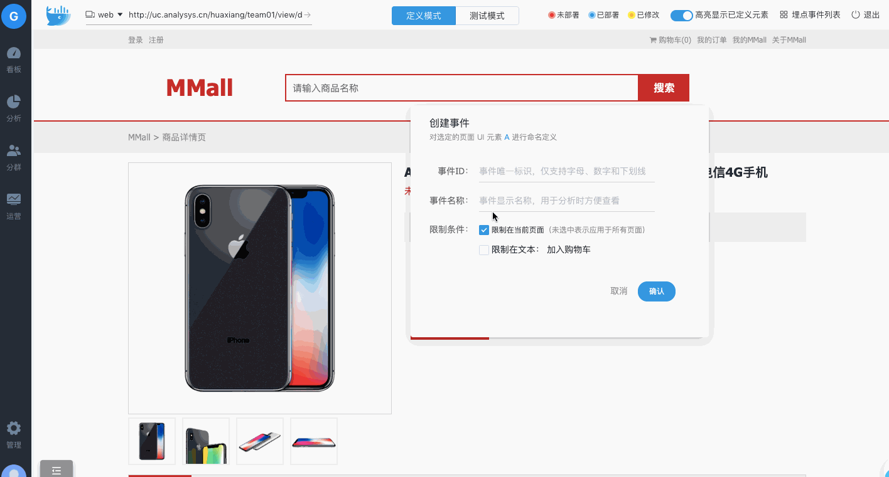
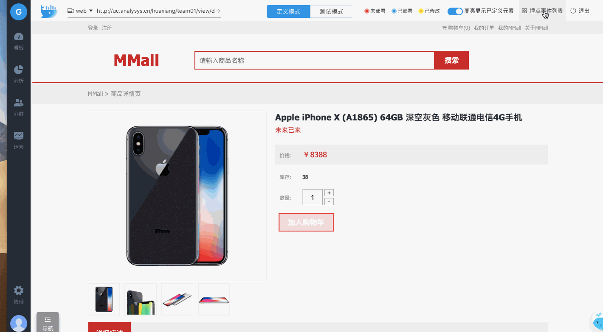

# 2. 可视化埋点

可视化埋点可以让非技术人员零门槛的根据业务需要直接在页面上定义事件，提高获取数据的效率。


开始前请确认已进行了如下操作：  
[https://docs.analysys.cn/ark/integration/sdk/js\#ke-shi-hua-mai-dian-jie-shao](https://docs.analysys.cn/ark/integration/sdk/js#ke-shi-hua-mai-dian-jie-shao)


对网站的页面元素进行可视化埋点需要 3 个步骤：

## **1. 选择要埋点页面**

以商品详情页面为例，
进入选择要埋点页面后在页面中部输入框输入商品详情页面的url地址，回车或点击输入框右侧箭头图标，进入可视化配置页面。

##  **2. 可视化配置**

进入可视化配置页面，若对加入购物车进行埋点，点击加入购物车按钮，弹出埋点内容选框，创建事件：输入事件ID和事件名称，点击确定即可。


事件ID：即事件的唯一标识，必填，仅支持字母、数字和下划线组成，且不能以数字开头

事件名称：非必填项，但建议填写，方便在分析时查看


##  **3. 测试 & 部署**

选择右上角埋点事件列表，列表内出现刚才所埋点的信息，点击部署，埋点事件即可生效。埋点生效后，可进入分析模型对埋点的事件进行分析。


可视化埋点适用于页面上某些元素的统计，若想对复杂的业务场景进行分析，可以根据业务需求设计埋点方案，进行代码埋点。





以上内容没有解答我的问题？[点击我来反馈](https://support.qq.com/products/118522/) 🚀


