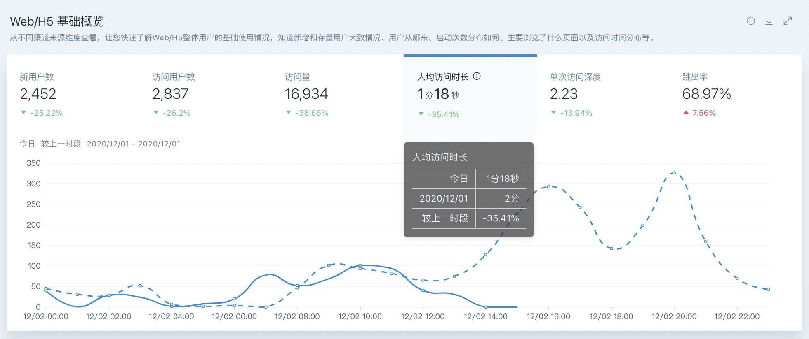

# V5.1.0317 体验优化& Bug修复


**更新要点：**

1. 优化了体验细节
2. 修复若干 Bug


## 优化

#### 1. 预置看板中指标移入后增加了更直观的数据标签

展示今日截止到查询时的指标数据和昨天完整天的指标数据

#### 2. 页面性能优化

* 优化了单用户档案中行为序列数据量过大时的加载体验
* 优化了事件分析 B表格下数据量过大时的加载体验

## 修复 Bug

* 修复了渠道分析带留存率指标和公共过滤条件时查询异常的问题
* 修复了当前为周日时选择日期组件中的本周时日期范围显示异常
* 修复了自定义指标细分维度查询，当指标在某个维度值下无结果时查询异常的问题
* 修复了当一条数据中有多个属性错误，且包含Profile预置属性时导致的程序异常

